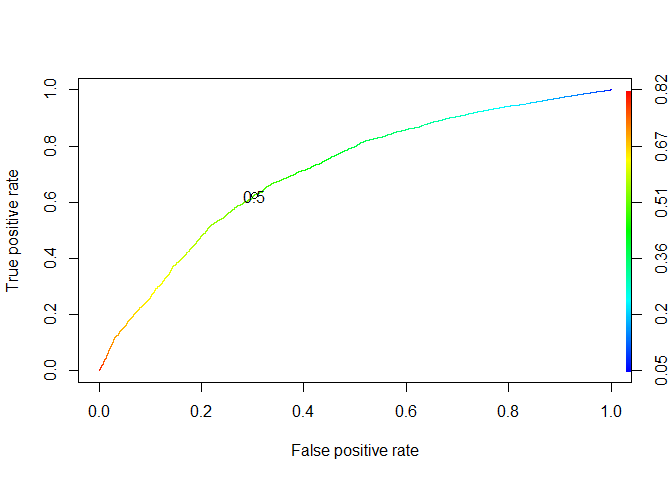

MiTH
================
Tom J Isac
14 July 2018

Efficient project management by Employee Over-Time prediction

A manufacturing unit is consistently facing project over-time to finish. This is usually a sign for poor project planning or resource allocation. Now the company has decided smartly allocate the resource based on ML models. One indicator they have about project going out-of-budget is number of employees working overtime. If a good predictive model can help them predict which employees are expected to do overtime, then they can balance the resource allocation accordingly.

Build a Machine Learning model which will predict whether an employee will bill overtime on a project or not.

Clearing all global objects
---------------------------

``` r
rm(list =ls(all.names = TRUE)) 
```

Setting the path and working directory
--------------------------------------

``` r
getwd()
```

    ## [1] "F:/Projects/Resource Allocation"

``` r
setwd("F:\\Projects\\Resource Allocation")
```

Loading all required libraries
------------------------------

``` r
library(dplyr)
```

    ## 
    ## Attaching package: 'dplyr'

    ## The following objects are masked from 'package:stats':
    ## 
    ##     filter, lag

    ## The following objects are masked from 'package:base':
    ## 
    ##     intersect, setdiff, setequal, union

``` r
library(tidyverse)
```

    ## -- Attaching packages ---------------------------------- tidyverse 1.2.1 --

    ## v ggplot2 2.2.1     v readr   1.1.1
    ## v tibble  1.4.2     v purrr   0.2.4
    ## v tidyr   0.8.0     v stringr 1.3.0
    ## v ggplot2 2.2.1     v forcats 0.3.0

    ## -- Conflicts ------------------------------------- tidyverse_conflicts() --
    ## x dplyr::filter() masks stats::filter()
    ## x dplyr::lag()    masks stats::lag()

``` r
library(caret)
```

    ## Loading required package: lattice

    ## 
    ## Attaching package: 'caret'

    ## The following object is masked from 'package:purrr':
    ## 
    ##     lift

``` r
library(gridExtra)
```

    ## 
    ## Attaching package: 'gridExtra'

    ## The following object is masked from 'package:dplyr':
    ## 
    ##     combine

``` r
library(ggridges)
library(GGally)
```

    ## 
    ## Attaching package: 'GGally'

    ## The following object is masked from 'package:dplyr':
    ## 
    ##     nasa

``` r
library(hexbin)

library(corrplot)
```

    ## corrplot 0.84 loaded

``` r
library(DMwR)
```

    ## Loading required package: grid

``` r
library(randomForest)
```

    ## randomForest 4.6-14

    ## Type rfNews() to see new features/changes/bug fixes.

    ## 
    ## Attaching package: 'randomForest'

    ## The following object is masked from 'package:gridExtra':
    ## 
    ##     combine

    ## The following object is masked from 'package:ggplot2':
    ## 
    ##     margin

    ## The following object is masked from 'package:dplyr':
    ## 
    ##     combine

``` r
library(ROCR)
```

    ## Loading required package: gplots

    ## 
    ## Attaching package: 'gplots'

    ## The following object is masked from 'package:stats':
    ## 
    ##     lowess

``` r
library(class)

library(MASS)
```

    ## 
    ## Attaching package: 'MASS'

    ## The following object is masked from 'package:dplyr':
    ## 
    ##     select

``` r
library(vegan)
```

    ## Loading required package: permute

    ## This is vegan 2.4-6

    ## 
    ## Attaching package: 'vegan'

    ## The following object is masked from 'package:caret':
    ## 
    ##     tolerance

``` r
library(ada)
```

    ## Loading required package: rpart

Read the data

``` r
data <- read.csv("dataset.csv", header = T)
train <- filter(data, istrain == 1) # Using filter function in dplyr package to split test and train
test <- filter(data, istrain!= 1) 
rm(data) # Remove from memory the initial data
```

Dropping the istrain column after ths split since it is irrelevant

``` r
train$istrain <- NULL
test$istrain <- NULL
```

Dropping ROW ID from target and test

``` r
train$RowID <- NULL
test_index <- test$RowID # Test index is stored to be used in submission file later
test$RowID <- NULL 
test$ExtraTime <- NULL # Dropping target variable from test data also
```

Structure of the data
---------------------

``` r
str(train)
```

    ## 'data.frame':    40303 obs. of  34 variables:
    ##  $ Joblevel                        : int  1 2 1 1 1 1 2 3 2 3 ...
    ##  $ DistancetoHome                  : int  3 15 24 5 2 5 5 1 1 11 ...
    ##  $ FrequencyofTravel               : Factor w/ 3 levels "High","Less",..: 2 2 2 2 2 2 1 2 2 3 ...
    ##  $ Gender                          : Factor w/ 2 levels "Female","Male": 1 1 2 2 2 1 2 2 1 2 ...
    ##  $ OfficeAmbienceRating            : int  3 4 3 1 4 2 1 1 2 3 ...
    ##  $ MonthlyRate                     : int  9964 12682 12947 15053 4306 13072 20445 19294 4009 8302 ...
    ##  $ YearsSinceLastPromotion         : int  0 0 0 0 1 0 0 0 1 2 ...
    ##  $ SelfMotivationRating            : int  4 2 2 4 3 2 3 2 3 2 ...
    ##  $ Division                        : Factor w/ 3 levels "Human Resources",..: 2 2 2 2 2 2 3 2 3 2 ...
    ##  $ Over18                          : Factor w/ 1 level "Y": 1 1 1 1 1 1 1 1 1 1 ...
    ##  $ Hourlyrate                      : int  81 49 50 80 45 82 98 98 75 79 ...
    ##  $ JobRole                         : Factor w/ 9 levels "Healthcare Representative",..: 3 3 3 7 7 7 8 3 8 1 ...
    ##  $ RelationshipSatisfaction        : int  1 4 2 4 3 4 3 4 3 3 ...
    ##  $ Education                       : int  3 2 3 2 3 4 4 2 5 2 ...
    ##  $ No.ofWorkshopsAttended          : int  3 3 4 5 3 3 4 2 2 3 ...
    ##  $ EmployeeCount                   : int  1 1 1 1 1 1 1 1 1 1 ...
    ##  $ datacollected                   : Factor w/ 1 level "3/20/2014": 1 1 1 1 1 1 1 1 1 1 ...
    ##  $ Age                             : int  59 29 28 32 38 36 46 48 44 35 ...
    ##  $ YearsInCurrentRole              : int  0 5 2 2 2 1 6 0 3 0 ...
    ##  $ NumberofCompaniesChanged        : int  4 0 5 0 5 9 4 9 5 2 ...
    ##  $ WorkLifeBalance                 : int  2 3 3 2 3 4 3 3 2 3 ...
    ##  $ Emolumnet_in_Pecentage          : int  20 12 14 12 11 14 21 13 21 13 ...
    ##  $ DialyRate                       : int  1324 153 103 334 371 852 1211 626 1488 1097 ...
    ##  $ StandardHours                   : int  80 80 80 80 80 80 80 80 80 80 ...
    ##  $ ExtraTime                       : Factor w/ 2 levels "No","Yes": 1 1 1 2 1 2 2 2 1 2 ...
    ##  $ FirstJobDate                    : Factor w/ 1486 levels "4/20/1974","4/20/1978",..: 1366 555 108 859 1336 1446 999 768 445 894 ...
    ##  $ EmployeeID                      : int  10 15 19 21 24 51 62 64 68 70 ...
    ##  $ Happynesslevelinjob             : int  1 3 3 2 4 1 4 3 1 1 ...
    ##  $ DateOfjoiningintheCurrentCompany: Factor w/ 1234 levels "4/20/1977","4/20/1981",..: 569 52 263 1228 659 630 1001 1140 234 445 ...
    ##  $ ESOps                           : int  3 0 0 2 0 1 0 0 1 1 ...
    ##  $ MonthlyIncome                   : int  2670 4193 2028 3298 3944 3419 5772 5381 5454 9884 ...
    ##  $ Specialization                  : Factor w/ 6 levels "Human Resources",..: 4 2 2 2 2 2 3 2 3 4 ...
    ##  $ PerformanceRating               : int  4 3 3 3 3 3 4 3 4 3 ...
    ##  $ MaritalStatus                   : Factor w/ 3 levels "Divorced","Married",..: 2 3 3 1 3 2 3 3 1 2 ...

``` r
# JobLevel, Education should be converted to factor
```

Summary of the data
===================

``` r
summary(train)
```

    ##     Joblevel     DistancetoHome   FrequencyofTravel    Gender     
    ##  Min.   :1.000   Min.   : 1.000   High    : 7138    Female:18111  
    ##  1st Qu.:1.000   1st Qu.: 3.000   Less    :30254    Male  :22192  
    ##  Median :2.000   Median : 7.000   NoTravel: 2911                  
    ##  Mean   :1.907   Mean   : 9.309                                   
    ##  3rd Qu.:2.000   3rd Qu.:14.000                                   
    ##  Max.   :5.000   Max.   :29.000                                   
    ##                                                                   
    ##  OfficeAmbienceRating  MonthlyRate    YearsSinceLastPromotion
    ##  Min.   :1.000        Min.   : 2094   Min.   : 0.000         
    ##  1st Qu.:2.000        1st Qu.: 8744   1st Qu.: 0.000         
    ##  Median :3.000        Median :13077   Median : 1.000         
    ##  Mean   :2.896        Mean   :13692   Mean   : 1.781         
    ##  3rd Qu.:4.000        3rd Qu.:19002   3rd Qu.: 2.000         
    ##  Max.   :4.000        Max.   :26968   Max.   :15.000         
    ##                                                              
    ##  SelfMotivationRating                   Division     Over18   
    ##  Min.   :1.000        Human Resources       : 1303   Y:40303  
    ##  1st Qu.:2.000        Research & Development:29959            
    ##  Median :3.000        Sales                 : 9041            
    ##  Mean   :2.684                                                
    ##  3rd Qu.:3.000                                                
    ##  Max.   :4.000                                                
    ##                                                               
    ##    Hourlyrate                         JobRole     
    ##  Min.   : 30.0   Laboratory Technician    :13283  
    ##  1st Qu.: 51.0   Research Scientist       : 7059  
    ##  Median : 65.0   Sales Executive          : 6598  
    ##  Mean   : 66.2   Manufacturing Director   : 3573  
    ##  3rd Qu.: 82.0   Healthcare Representative: 2984  
    ##  Max.   :100.0   Manager                  : 2101  
    ##                  (Other)                  : 4705  
    ##  RelationshipSatisfaction   Education     No.ofWorkshopsAttended
    ##  Min.   :1.000            Min.   :1.000   Min.   :0.000         
    ##  1st Qu.:2.000            1st Qu.:2.000   1st Qu.:2.000         
    ##  Median :3.000            Median :3.000   Median :3.000         
    ##  Mean   :2.585            Mean   :2.877   Mean   :2.916         
    ##  3rd Qu.:3.000            3rd Qu.:4.000   3rd Qu.:3.000         
    ##  Max.   :4.000            Max.   :5.000   Max.   :6.000         
    ##                                                                 
    ##  EmployeeCount   datacollected        Age        YearsInCurrentRole
    ##  Min.   :1     3/20/2014:40303   Min.   :18.00   Min.   : 0.000    
    ##  1st Qu.:1                       1st Qu.:31.00   1st Qu.: 2.000    
    ##  Median :1                       Median :36.00   Median : 3.000    
    ##  Mean   :1                       Mean   :37.73   Mean   : 3.772    
    ##  3rd Qu.:1                       3rd Qu.:44.00   3rd Qu.: 6.000    
    ##  Max.   :1                       Max.   :60.00   Max.   :18.000    
    ##                                                                    
    ##  NumberofCompaniesChanged WorkLifeBalance Emolumnet_in_Pecentage
    ##  Min.   :0.000            Min.   :1.000   Min.   :11.00         
    ##  1st Qu.:1.000            1st Qu.:2.000   1st Qu.:13.00         
    ##  Median :3.000            Median :3.000   Median :14.00         
    ##  Mean   :3.046            Mean   :2.772   Mean   :15.15         
    ##  3rd Qu.:5.000            3rd Qu.:3.000   3rd Qu.:17.00         
    ##  Max.   :9.000            Max.   :4.000   Max.   :25.00         
    ##                                                                 
    ##    DialyRate      StandardHours ExtraTime      FirstJobDate  
    ##  Min.   : 103.0   Min.   :80    No :21852   4/27/2004:  170  
    ##  1st Qu.: 444.0   1st Qu.:80    Yes:18451   4/26/2004:  163  
    ##  Median : 819.0   Median :80                4/25/2004:  160  
    ##  Mean   : 807.5   Mean   :80                4/23/2004:  156  
    ##  3rd Qu.:1187.0   3rd Qu.:80                4/28/2004:  156  
    ##  Max.   :1499.0   Max.   :80                5/21/2004:  152  
    ##                                             (Other)  :39346  
    ##    EmployeeID     Happynesslevelinjob DateOfjoiningintheCurrentCompany
    ##  Min.   :   2.0   Min.   :1.000       7/29/2009:  164                 
    ##  1st Qu.: 235.0   1st Qu.:2.000       7/22/2009:  154                 
    ##  Median : 652.0   Median :3.000       6/28/2009:  149                 
    ##  Mean   : 797.5   Mean   :2.714       7/28/2009:  149                 
    ##  3rd Qu.:1301.0   3rd Qu.:3.000       7/30/2009:  147                 
    ##  Max.   :2068.0   Max.   :4.000       5/26/2009:  146                 
    ##                                       (Other)  :39394                 
    ##      ESOps        MonthlyIncome            Specialization 
    ##  Min.   :0.0000   Min.   : 1074   Human Resources :  520  
    ##  1st Qu.:0.0000   1st Qu.: 2823   Life Sciences   :18365  
    ##  Median :1.0000   Median : 4287   Marketing       : 3172  
    ##  Mean   :0.7259   Mean   : 5860   Medical         :11943  
    ##  3rd Qu.:1.0000   3rd Qu.: 6852   Other           : 3799  
    ##  Max.   :3.0000   Max.   :19999   Technical Degree: 2504  
    ##                                                           
    ##  PerformanceRating  MaritalStatus  
    ##  Min.   :3.000     Divorced: 6251  
    ##  1st Qu.:3.000     Married :18651  
    ##  Median :3.000     Single  :15401  
    ##  Mean   :3.162                     
    ##  3rd Qu.:3.000                     
    ##  Max.   :4.000                     
    ## 

First 5 rows
============

Last 10 rows of data
====================

``` r
head(train)
```

    ##   Joblevel DistancetoHome FrequencyofTravel Gender OfficeAmbienceRating
    ## 1        1              3              Less Female                    3
    ## 2        2             15              Less Female                    4
    ## 3        1             24              Less   Male                    3
    ## 4        1              5              Less   Male                    1
    ## 5        1              2              Less   Male                    4
    ## 6        1              5              Less Female                    2
    ##   MonthlyRate YearsSinceLastPromotion SelfMotivationRating
    ## 1        9964                       0                    4
    ## 2       12682                       0                    2
    ## 3       12947                       0                    2
    ## 4       15053                       0                    4
    ## 5        4306                       1                    3
    ## 6       13072                       0                    2
    ##                 Division Over18 Hourlyrate               JobRole
    ## 1 Research & Development      Y         81 Laboratory Technician
    ## 2 Research & Development      Y         49 Laboratory Technician
    ## 3 Research & Development      Y         50 Laboratory Technician
    ## 4 Research & Development      Y         80    Research Scientist
    ## 5 Research & Development      Y         45    Research Scientist
    ## 6 Research & Development      Y         82    Research Scientist
    ##   RelationshipSatisfaction Education No.ofWorkshopsAttended EmployeeCount
    ## 1                        1         3                      3             1
    ## 2                        4         2                      3             1
    ## 3                        2         3                      4             1
    ## 4                        4         2                      5             1
    ## 5                        3         3                      3             1
    ## 6                        4         4                      3             1
    ##   datacollected Age YearsInCurrentRole NumberofCompaniesChanged
    ## 1     3/20/2014  59                  0                        4
    ## 2     3/20/2014  29                  5                        0
    ## 3     3/20/2014  28                  2                        5
    ## 4     3/20/2014  32                  2                        0
    ## 5     3/20/2014  38                  2                        5
    ## 6     3/20/2014  36                  1                        9
    ##   WorkLifeBalance Emolumnet_in_Pecentage DialyRate StandardHours ExtraTime
    ## 1               2                     20      1324            80        No
    ## 2               3                     12       153            80        No
    ## 3               3                     14       103            80        No
    ## 4               2                     12       334            80       Yes
    ## 5               3                     11       371            80        No
    ## 6               4                     14       852            80       Yes
    ##   FirstJobDate EmployeeID Happynesslevelinjob
    ## 1    7/27/2002         10                   1
    ## 2    5/25/2004         15                   3
    ## 3    4/22/2008         19                   3
    ## 4    6/22/2007         21                   2
    ## 5    7/26/2008         24                   4
    ## 6    7/29/2008         51                   1
    ##   DateOfjoiningintheCurrentCompany ESOps MonthlyIncome Specialization
    ## 1                        5/29/2013     3          2670        Medical
    ## 2                        4/21/2005     0          4193  Life Sciences
    ## 3                        4/28/2010     0          2028  Life Sciences
    ## 4                        7/30/2008     2          3298  Life Sciences
    ## 5                        6/21/2011     0          3944  Life Sciences
    ## 6                        6/20/2013     1          3419  Life Sciences
    ##   PerformanceRating MaritalStatus
    ## 1                 4       Married
    ## 2                 3        Single
    ## 3                 3        Single
    ## 4                 3      Divorced
    ## 5                 3        Single
    ## 6                 3       Married

``` r
tail(train,10)
```

    ##       Joblevel DistancetoHome FrequencyofTravel Gender
    ## 40294        1              8          NoTravel   Male
    ## 40295        1              8              Less   Male
    ## 40296        2             14              Less Female
    ## 40297        1             21              Less   Male
    ## 40298        3             22          NoTravel Female
    ## 40299        3             25              Less   Male
    ## 40300        3             16              Less Female
    ## 40301        3             18              High   Male
    ## 40302        2             19              Less   Male
    ## 40303        1              9              Less   Male
    ##       OfficeAmbienceRating MonthlyRate YearsSinceLastPromotion
    ## 40294                    1        5869                       1
    ## 40295                    4        4892                       0
    ## 40296                    3        7824                       0
    ## 40297                    3       10036                       0
    ## 40298                    3        2890                       7
    ## 40299                    4        9129                       4
    ## 40300                    4       21195                       3
    ## 40301                    3       19944                       2
    ## 40302                    3       26493                       0
    ## 40303                    1        6311                       4
    ##       SelfMotivationRating               Division Over18 Hourlyrate
    ## 40294                    1 Research & Development      Y         87
    ## 40295                    4 Research & Development      Y         36
    ## 40296                    2                  Sales      Y         68
    ## 40297                    2 Research & Development      Y         57
    ## 40298                    3                  Sales      Y         69
    ## 40299                    2 Research & Development      Y         78
    ## 40300                    2 Research & Development      Y         91
    ## 40301                    3 Research & Development      Y         60
    ## 40302                    3 Research & Development      Y         85
    ## 40303                    3 Research & Development      Y         60
    ##                         JobRole RelationshipSatisfaction Education
    ## 40294     Laboratory Technician                        4         5
    ## 40295     Laboratory Technician                        4         1
    ## 40296           Sales Executive                        1         2
    ## 40297     Laboratory Technician                        2         2
    ## 40298           Sales Executive                        3         4
    ## 40299    Manufacturing Director                        1         3
    ## 40300 Healthcare Representative                        4         3
    ## 40301    Manufacturing Director                        3         2
    ## 40302    Manufacturing Director                        1         3
    ## 40303        Research Scientist                        2         3
    ##       No.ofWorkshopsAttended EmployeeCount datacollected Age
    ## 40294                      4             1     3/20/2014  27
    ## 40295                      2             1     3/20/2014  35
    ## 40296                      6             1     3/20/2014  42
    ## 40297                      3             1     3/20/2014  24
    ## 40298                      3             1     3/20/2014  30
    ## 40299                      2             1     3/20/2014  35
    ## 40300                      3             1     3/20/2014  35
    ## 40301                      2             1     3/20/2014  35
    ## 40302                      2             1     3/20/2014  37
    ## 40303                      5             1     3/20/2014  33
    ##       YearsInCurrentRole NumberofCompaniesChanged WorkLifeBalance
    ## 40294                  2                        1               3
    ## 40295                  0                        1               3
    ## 40296                  4                        7               3
    ## 40297                  1                        0               3
    ## 40298                  8                        0               3
    ## 40299                 10                        3               3
    ## 40300                  8                        1               1
    ## 40301                  2                        2               3
    ## 40302                  3                        3               2
    ## 40303                 10                        0               3
    ##       Emolumnet_in_Pecentage DialyRate StandardHours ExtraTime
    ## 40294                     19      1277            80        No
    ## 40295                     19      1229            80        No
    ## 40296                     17       462            80        No
    ## 40297                     14       350            80        No
    ## 40298                     11      1398            80        No
    ## 40299                     16       672            80        No
    ## 40300                     19      1029            80        No
    ## 40301                     11       200            80        No
    ## 40302                     17       671            80        No
    ## 40303                     13       117            80        No
    ##       FirstJobDate EmployeeID Happynesslevelinjob
    ## 40294    7/24/2011       1094                   3
    ## 40295    5/24/2013         63                   4
    ## 40296    4/29/2004        936                   3
    ## 40297    4/22/2012       1551                   1
    ## 40298    7/26/2004        567                   1
    ## 40299    4/20/1998        899                   2
    ## 40300    6/22/2003       1529                   2
    ## 40301    7/22/2004       1412                   4
    ## 40302    6/29/2005       1631                   3
    ## 40303    7/30/1999       1238                   4
    ##       DateOfjoiningintheCurrentCompany ESOps MonthlyIncome
    ## 40294                        7/26/2011     3          4621
    ## 40295                        5/25/2013     0          2269
    ## 40296                        7/23/2009     0          6244
    ## 40297                        5/22/2013     3          2296
    ## 40298                        5/27/2005     0          8412
    ## 40299                        5/30/2001     0         10903
    ## 40300                        7/30/2003     0          8606
    ## 40301                        4/23/2012     0          9362
    ## 40302                        5/21/2010     3          5768
    ## 40303                        7/22/2000     1          2781
    ##         Specialization PerformanceRating MaritalStatus
    ## 40294    Life Sciences                 3       Married
    ## 40295    Life Sciences                 3       Married
    ## 40296          Medical                 3        Single
    ## 40297 Technical Degree                 3      Divorced
    ## 40298            Other                 3       Married
    ## 40299 Technical Degree                 3       Married
    ## 40300    Life Sciences                 3        Single
    ## 40301    Life Sciences                 3        Single
    ## 40302    Life Sciences                 3       Married
    ## 40303          Medical                 3       Married

Check for NA in the dataset
---------------------------

``` r
sum(is.na(train))
```

    ## [1] 0

``` r
sum(is.na(test))
```

    ## [1] 0

``` r
# No NA's present in the dataset
```

Visualisation
-------------

1.  Job Role v/s Extra Time

``` r
train %>%
  count(JobRole,ExtraTime) %>%
  filter(ExtraTime == 'Yes') %>%
  ggplot(aes(n,reorder(JobRole,n))) +
  geom_point() +
  xlab('Count of people working Extra Time') + ylab('Job Role') +
  geom_segment(aes(x = 0, xend = n, y = JobRole, yend = JobRole), size = .15)
```


1.  Job Level v/s Extra Time

``` r
train %>%
  count(Joblevel,ExtraTime) %>%
  filter(ExtraTime == 'Yes') %>%
  ggplot(aes(n,reorder(Joblevel,n))) +
  geom_point() +
  xlab('Count of people working Extra Time') + ylab('Job Level') 
```


1.  Gender v/s Extra Time

``` r
 p <- ggplot(train, aes(Gender,ExtraTime))
 p + geom_bar(stat = "identity", aes(fill = ExtraTime))
```


1.  Department v/s Extra Time

``` r
 p <- ggplot(train, aes(Division,ExtraTime))
 p + geom_bar(stat = "identity", aes(fill = ExtraTime))
```


#### Feature Engineering

1) isTrain and Row ID is dropped initially
==========================================

Additionaly drop Employee ID
============================

``` r
train$EmployeeID <- NULL
test$EmployeeID <- NULL
```

2) Columns with a unique value and handling
-------------------------------------------

Over18, EmployeeCount and StandardHours has only one value. They can be dropped

``` r
length(unique(train$Over18)) 
```

    ## [1] 1

``` r
length(unique(train$EmployeeCount))
```

    ## [1] 1

``` r
length(unique(train$StandardHours))
```

    ## [1] 1

``` r
# Columns Over18 and StandardHours has only one value, they can be dropped due to no variance

train$Over18 <- NULL
test$Over18 <- NULL
train$StandardHours <- NULL
test$StandardHours <- NULL
train$EmployeeCount <- NULL
test$EmployeeCount <- NULL
```

``` r
summary(train)
```

    ##     Joblevel     DistancetoHome   FrequencyofTravel    Gender     
    ##  Min.   :1.000   Min.   : 1.000   High    : 7138    Female:18111  
    ##  1st Qu.:1.000   1st Qu.: 3.000   Less    :30254    Male  :22192  
    ##  Median :2.000   Median : 7.000   NoTravel: 2911                  
    ##  Mean   :1.907   Mean   : 9.309                                   
    ##  3rd Qu.:2.000   3rd Qu.:14.000                                   
    ##  Max.   :5.000   Max.   :29.000                                   
    ##                                                                   
    ##  OfficeAmbienceRating  MonthlyRate    YearsSinceLastPromotion
    ##  Min.   :1.000        Min.   : 2094   Min.   : 0.000         
    ##  1st Qu.:2.000        1st Qu.: 8744   1st Qu.: 0.000         
    ##  Median :3.000        Median :13077   Median : 1.000         
    ##  Mean   :2.896        Mean   :13692   Mean   : 1.781         
    ##  3rd Qu.:4.000        3rd Qu.:19002   3rd Qu.: 2.000         
    ##  Max.   :4.000        Max.   :26968   Max.   :15.000         
    ##                                                              
    ##  SelfMotivationRating                   Division       Hourlyrate   
    ##  Min.   :1.000        Human Resources       : 1303   Min.   : 30.0  
    ##  1st Qu.:2.000        Research & Development:29959   1st Qu.: 51.0  
    ##  Median :3.000        Sales                 : 9041   Median : 65.0  
    ##  Mean   :2.684                                       Mean   : 66.2  
    ##  3rd Qu.:3.000                                       3rd Qu.: 82.0  
    ##  Max.   :4.000                                       Max.   :100.0  
    ##                                                                     
    ##                       JobRole      RelationshipSatisfaction
    ##  Laboratory Technician    :13283   Min.   :1.000           
    ##  Research Scientist       : 7059   1st Qu.:2.000           
    ##  Sales Executive          : 6598   Median :3.000           
    ##  Manufacturing Director   : 3573   Mean   :2.585           
    ##  Healthcare Representative: 2984   3rd Qu.:3.000           
    ##  Manager                  : 2101   Max.   :4.000           
    ##  (Other)                  : 4705                           
    ##    Education     No.ofWorkshopsAttended   datacollected        Age       
    ##  Min.   :1.000   Min.   :0.000          3/20/2014:40303   Min.   :18.00  
    ##  1st Qu.:2.000   1st Qu.:2.000                            1st Qu.:31.00  
    ##  Median :3.000   Median :3.000                            Median :36.00  
    ##  Mean   :2.877   Mean   :2.916                            Mean   :37.73  
    ##  3rd Qu.:4.000   3rd Qu.:3.000                            3rd Qu.:44.00  
    ##  Max.   :5.000   Max.   :6.000                            Max.   :60.00  
    ##                                                                          
    ##  YearsInCurrentRole NumberofCompaniesChanged WorkLifeBalance
    ##  Min.   : 0.000     Min.   :0.000            Min.   :1.000  
    ##  1st Qu.: 2.000     1st Qu.:1.000            1st Qu.:2.000  
    ##  Median : 3.000     Median :3.000            Median :3.000  
    ##  Mean   : 3.772     Mean   :3.046            Mean   :2.772  
    ##  3rd Qu.: 6.000     3rd Qu.:5.000            3rd Qu.:3.000  
    ##  Max.   :18.000     Max.   :9.000            Max.   :4.000  
    ##                                                             
    ##  Emolumnet_in_Pecentage   DialyRate      ExtraTime      FirstJobDate  
    ##  Min.   :11.00          Min.   : 103.0   No :21852   4/27/2004:  170  
    ##  1st Qu.:13.00          1st Qu.: 444.0   Yes:18451   4/26/2004:  163  
    ##  Median :14.00          Median : 819.0               4/25/2004:  160  
    ##  Mean   :15.15          Mean   : 807.5               4/23/2004:  156  
    ##  3rd Qu.:17.00          3rd Qu.:1187.0               4/28/2004:  156  
    ##  Max.   :25.00          Max.   :1499.0               5/21/2004:  152  
    ##                                                      (Other)  :39346  
    ##  Happynesslevelinjob DateOfjoiningintheCurrentCompany     ESOps       
    ##  Min.   :1.000       7/29/2009:  164                  Min.   :0.0000  
    ##  1st Qu.:2.000       7/22/2009:  154                  1st Qu.:0.0000  
    ##  Median :3.000       6/28/2009:  149                  Median :1.0000  
    ##  Mean   :2.714       7/28/2009:  149                  Mean   :0.7259  
    ##  3rd Qu.:3.000       7/30/2009:  147                  3rd Qu.:1.0000  
    ##  Max.   :4.000       5/26/2009:  146                  Max.   :3.0000  
    ##                      (Other)  :39394                                  
    ##  MonthlyIncome            Specialization  PerformanceRating
    ##  Min.   : 1074   Human Resources :  520   Min.   :3.000    
    ##  1st Qu.: 2823   Life Sciences   :18365   1st Qu.:3.000    
    ##  Median : 4287   Marketing       : 3172   Median :3.000    
    ##  Mean   : 5860   Medical         :11943   Mean   :3.162    
    ##  3rd Qu.: 6852   Other           : 3799   3rd Qu.:3.000    
    ##  Max.   :19999   Technical Degree: 2504   Max.   :4.000    
    ##                                                            
    ##   MaritalStatus  
    ##  Divorced: 6251  
    ##  Married :18651  
    ##  Single  :15401  
    ##                  
    ##                  
    ##                  
    ## 

Check if Division categories and JobRoles add up in the entire dataset
----------------------------------------------------------------------

Initial data is called again
============================

``` r
data <- read.csv("dataset.csv", header = T)
summary(data$Division)
```

    ##        Human Resources Research & Development                  Sales 
    ##                   1626                  37383                  11332

``` r
summary(data$JobRole)
```

    ## Healthcare Representative           Human Resources 
    ##                      3722                      1435 
    ##     Laboratory Technician                   Manager 
    ##                     16558                      2631 
    ##    Manufacturing Director         Research Director 
    ##                      4459                      2463 
    ##        Research Scientist           Sales Executive 
    ##                      8822                      8277 
    ##      Sales Representative 
    ##                      1974

``` r
rm(data)
```

Since, no column can be explained as the sum of multiple columns, need to keep both Division and JobRole

3) Handling Date columns
------------------------

Creation of two new columns
===========================

workExp - Number of days between initial joining date and date of data collection
=================================================================================

currentExp - Number of days between joining date in this company and date of data collection
============================================================================================

``` r
train$workExp <- as.Date(as.character(train$datacollected), format="%m/%d/%Y")-
                  as.Date(as.character(train$FirstJobDate), format="%m/%d/%Y")
train$currentExp <- as.Date(as.character(train$datacollected), format="%m/%d/%Y")-
                  as.Date(as.character(train$DateOfjoiningintheCurrentCompany), format="%m/%d/%Y")


test$workExp <- as.Date(as.character(test$datacollected), format="%m/%d/%Y")-
                  as.Date(as.character(test$FirstJobDate), format="%m/%d/%Y")
test$currentExp <- as.Date(as.character(test$datacollected), format="%m/%d/%Y")-
                  as.Date(as.character(test$DateOfjoiningintheCurrentCompany), format="%m/%d/%Y")
```

Converting to numeric type for arithemtic operations
====================================================

``` r
class(train$workExp)
```

    ## [1] "difftime"

``` r
# Type is difftime. Converting to numeric

train$workExp <- as.numeric(train$workExp)
train$currentExp <- as.numeric(train$currentExp)

test$workExp <- as.numeric(test$workExp)
test$currentExp <- as.numeric(test$currentExp)

class(train$workExp)
```

    ## [1] "numeric"

Check for negative value - some values are negative in train and test because data is collected after the reference dataCollected column
========================================================================================================================================

``` r
min(train$workExp)
```

    ## [1] -128

``` r
min(train$currentExp)
```

    ## [1] -132

``` r
min(test$workExp)
```

    ## [1] -129

``` r
min(test$currentExp)
```

    ## [1] -132

Converting negative days to positive along with converting days to year rounded off to 1 decimal
================================================================================================

``` r
train$workExp <- abs(round(train$workExp/365, digits = 1))
train$currentExp <- abs(round(train$currentExp/365, digits = 1))

test$workExp <- abs(round(test$workExp/365, digits = 1))
test$currentExp <- abs(round(test$currentExp/365, digits = 1))
```

Dropping date columns - datacollected, FirstJobDate and DateOfjoiningintheCurrentCompany
========================================================================================

``` r
train$datacollected <- NULL
train$FirstJobDate <- NULL
train$DateOfjoiningintheCurrentCompany <- NULL

test$datacollected <- NULL
test$FirstJobDate <- NULL
test$DateOfjoiningintheCurrentCompany <- NULL
```

4) Conversion of factors for categorical variables
--------------------------------------------------

``` r
train$Joblevel <- as.factor(as.character(train$Joblevel))
test$Joblevel <- as.factor(as.character(test$Joblevel))
train$Education <- as.factor(as.character(train$Education))
test$Education <- as.factor(as.character(test$Education))
```

Ratings are not converted to factors since their average makes sense
====================================================================

``` r
summary(train)
```

    ##  Joblevel  DistancetoHome   FrequencyofTravel    Gender     
    ##  1:17412   Min.   : 1.000   High    : 7138    Female:18111  
    ##  2:14394   1st Qu.: 3.000   Less    :30254    Male  :22192  
    ##  3: 4841   Median : 7.000   NoTravel: 2911                  
    ##  4: 2155   Mean   : 9.309                                   
    ##  5: 1501   3rd Qu.:14.000                                   
    ##            Max.   :29.000                                   
    ##                                                             
    ##  OfficeAmbienceRating  MonthlyRate    YearsSinceLastPromotion
    ##  Min.   :1.000        Min.   : 2094   Min.   : 0.000         
    ##  1st Qu.:2.000        1st Qu.: 8744   1st Qu.: 0.000         
    ##  Median :3.000        Median :13077   Median : 1.000         
    ##  Mean   :2.896        Mean   :13692   Mean   : 1.781         
    ##  3rd Qu.:4.000        3rd Qu.:19002   3rd Qu.: 2.000         
    ##  Max.   :4.000        Max.   :26968   Max.   :15.000         
    ##                                                              
    ##  SelfMotivationRating                   Division       Hourlyrate   
    ##  Min.   :1.000        Human Resources       : 1303   Min.   : 30.0  
    ##  1st Qu.:2.000        Research & Development:29959   1st Qu.: 51.0  
    ##  Median :3.000        Sales                 : 9041   Median : 65.0  
    ##  Mean   :2.684                                       Mean   : 66.2  
    ##  3rd Qu.:3.000                                       3rd Qu.: 82.0  
    ##  Max.   :4.000                                       Max.   :100.0  
    ##                                                                     
    ##                       JobRole      RelationshipSatisfaction Education
    ##  Laboratory Technician    :13283   Min.   :1.000            1: 3084  
    ##  Research Scientist       : 7059   1st Qu.:2.000            2:10039  
    ##  Sales Executive          : 6598   Median :3.000            3:16978  
    ##  Manufacturing Director   : 3573   Mean   :2.585            4: 9145  
    ##  Healthcare Representative: 2984   3rd Qu.:3.000            5: 1057  
    ##  Manager                  : 2101   Max.   :4.000                     
    ##  (Other)                  : 4705                                     
    ##  No.ofWorkshopsAttended      Age        YearsInCurrentRole
    ##  Min.   :0.000          Min.   :18.00   Min.   : 0.000    
    ##  1st Qu.:2.000          1st Qu.:31.00   1st Qu.: 2.000    
    ##  Median :3.000          Median :36.00   Median : 3.000    
    ##  Mean   :2.916          Mean   :37.73   Mean   : 3.772    
    ##  3rd Qu.:3.000          3rd Qu.:44.00   3rd Qu.: 6.000    
    ##  Max.   :6.000          Max.   :60.00   Max.   :18.000    
    ##                                                           
    ##  NumberofCompaniesChanged WorkLifeBalance Emolumnet_in_Pecentage
    ##  Min.   :0.000            Min.   :1.000   Min.   :11.00         
    ##  1st Qu.:1.000            1st Qu.:2.000   1st Qu.:13.00         
    ##  Median :3.000            Median :3.000   Median :14.00         
    ##  Mean   :3.046            Mean   :2.772   Mean   :15.15         
    ##  3rd Qu.:5.000            3rd Qu.:3.000   3rd Qu.:17.00         
    ##  Max.   :9.000            Max.   :4.000   Max.   :25.00         
    ##                                                                 
    ##    DialyRate      ExtraTime   Happynesslevelinjob     ESOps       
    ##  Min.   : 103.0   No :21852   Min.   :1.000       Min.   :0.0000  
    ##  1st Qu.: 444.0   Yes:18451   1st Qu.:2.000       1st Qu.:0.0000  
    ##  Median : 819.0               Median :3.000       Median :1.0000  
    ##  Mean   : 807.5               Mean   :2.714       Mean   :0.7259  
    ##  3rd Qu.:1187.0               3rd Qu.:3.000       3rd Qu.:1.0000  
    ##  Max.   :1499.0               Max.   :4.000       Max.   :3.0000  
    ##                                                                   
    ##  MonthlyIncome            Specialization  PerformanceRating
    ##  Min.   : 1074   Human Resources :  520   Min.   :3.000    
    ##  1st Qu.: 2823   Life Sciences   :18365   1st Qu.:3.000    
    ##  Median : 4287   Marketing       : 3172   Median :3.000    
    ##  Mean   : 5860   Medical         :11943   Mean   :3.162    
    ##  3rd Qu.: 6852   Other           : 3799   3rd Qu.:3.000    
    ##  Max.   :19999   Technical Degree: 2504   Max.   :4.000    
    ##                                                            
    ##   MaritalStatus      workExp        currentExp    
    ##  Divorced: 6251   Min.   : 0.10   Min.   : 0.100  
    ##  Married :18651   1st Qu.: 6.80   1st Qu.: 2.700  
    ##  Single  :15401   Median : 9.70   Median : 4.800  
    ##                   Mean   :10.92   Mean   : 6.083  
    ##                   3rd Qu.:12.90   3rd Qu.: 7.900  
    ##                   Max.   :39.90   Max.   :39.900  
    ## 

``` r
str(train)
```

    ## 'data.frame':    40303 obs. of  29 variables:
    ##  $ Joblevel                : Factor w/ 5 levels "1","2","3","4",..: 1 2 1 1 1 1 2 3 2 3 ...
    ##  $ DistancetoHome          : int  3 15 24 5 2 5 5 1 1 11 ...
    ##  $ FrequencyofTravel       : Factor w/ 3 levels "High","Less",..: 2 2 2 2 2 2 1 2 2 3 ...
    ##  $ Gender                  : Factor w/ 2 levels "Female","Male": 1 1 2 2 2 1 2 2 1 2 ...
    ##  $ OfficeAmbienceRating    : int  3 4 3 1 4 2 1 1 2 3 ...
    ##  $ MonthlyRate             : int  9964 12682 12947 15053 4306 13072 20445 19294 4009 8302 ...
    ##  $ YearsSinceLastPromotion : int  0 0 0 0 1 0 0 0 1 2 ...
    ##  $ SelfMotivationRating    : int  4 2 2 4 3 2 3 2 3 2 ...
    ##  $ Division                : Factor w/ 3 levels "Human Resources",..: 2 2 2 2 2 2 3 2 3 2 ...
    ##  $ Hourlyrate              : int  81 49 50 80 45 82 98 98 75 79 ...
    ##  $ JobRole                 : Factor w/ 9 levels "Healthcare Representative",..: 3 3 3 7 7 7 8 3 8 1 ...
    ##  $ RelationshipSatisfaction: int  1 4 2 4 3 4 3 4 3 3 ...
    ##  $ Education               : Factor w/ 5 levels "1","2","3","4",..: 3 2 3 2 3 4 4 2 5 2 ...
    ##  $ No.ofWorkshopsAttended  : int  3 3 4 5 3 3 4 2 2 3 ...
    ##  $ Age                     : int  59 29 28 32 38 36 46 48 44 35 ...
    ##  $ YearsInCurrentRole      : int  0 5 2 2 2 1 6 0 3 0 ...
    ##  $ NumberofCompaniesChanged: int  4 0 5 0 5 9 4 9 5 2 ...
    ##  $ WorkLifeBalance         : int  2 3 3 2 3 4 3 3 2 3 ...
    ##  $ Emolumnet_in_Pecentage  : int  20 12 14 12 11 14 21 13 21 13 ...
    ##  $ DialyRate               : int  1324 153 103 334 371 852 1211 626 1488 1097 ...
    ##  $ ExtraTime               : Factor w/ 2 levels "No","Yes": 1 1 1 2 1 2 2 2 1 2 ...
    ##  $ Happynesslevelinjob     : int  1 3 3 2 4 1 4 3 1 1 ...
    ##  $ ESOps                   : int  3 0 0 2 0 1 0 0 1 1 ...
    ##  $ MonthlyIncome           : int  2670 4193 2028 3298 3944 3419 5772 5381 5454 9884 ...
    ##  $ Specialization          : Factor w/ 6 levels "Human Resources",..: 4 2 2 2 2 2 3 2 3 4 ...
    ##  $ PerformanceRating       : int  4 3 3 3 3 3 4 3 4 3 ...
    ##  $ MaritalStatus           : Factor w/ 3 levels "Divorced","Married",..: 2 3 3 1 3 2 3 3 1 2 ...
    ##  $ workExp                 : num  11.7 9.8 5.9 6.7 5.7 5.6 13.7 22.8 8.8 9.7 ...
    ##  $ currentExp              : num  0.8 8.9 3.9 5.6 2.7 0.7 8.7 0.6 3.9 3.8 ...

``` r
summary(test)
```

    ##  Joblevel DistancetoHome   FrequencyofTravel    Gender    
    ##  1:4363   Min.   : 1.000   High    :1726     Female:4499  
    ##  2:3533   1st Qu.: 3.000   Less    :7562     Male  :5539  
    ##  3:1234   Median : 7.000   NoTravel: 750                  
    ##  4: 572   Mean   : 9.327                                  
    ##  5: 336   3rd Qu.:14.000                                  
    ##           Max.   :29.000                                  
    ##                                                           
    ##  OfficeAmbienceRating  MonthlyRate    YearsSinceLastPromotion
    ##  Min.   :1.000        Min.   : 2094   Min.   : 0.000         
    ##  1st Qu.:2.000        1st Qu.: 8424   1st Qu.: 0.000         
    ##  Median :3.000        Median :13004   Median : 1.000         
    ##  Mean   :2.878        Mean   :13599   Mean   : 1.749         
    ##  3rd Qu.:4.000        3rd Qu.:18899   3rd Qu.: 2.000         
    ##  Max.   :4.000        Max.   :26968   Max.   :15.000         
    ##                                                              
    ##  SelfMotivationRating                   Division      Hourlyrate    
    ##  Min.   :1.000        Human Resources       : 323   Min.   : 30.00  
    ##  1st Qu.:2.000        Research & Development:7424   1st Qu.: 52.00  
    ##  Median :3.000        Sales                 :2291   Median : 66.00  
    ##  Mean   :2.687                                      Mean   : 66.53  
    ##  3rd Qu.:3.000                                      3rd Qu.: 82.00  
    ##  Max.   :4.000                                      Max.   :100.00  
    ##                                                                     
    ##                       JobRole     RelationshipSatisfaction Education
    ##  Laboratory Technician    :3275   Min.   :1.000            1: 756   
    ##  Research Scientist       :1763   1st Qu.:2.000            2:2467   
    ##  Sales Executive          :1679   Median :3.000            3:4272   
    ##  Manufacturing Director   : 886   Mean   :2.579            4:2301   
    ##  Healthcare Representative: 738   3rd Qu.:3.000            5: 242   
    ##  Manager                  : 530   Max.   :4.000                     
    ##  (Other)                  :1167                                     
    ##  No.ofWorkshopsAttended      Age        YearsInCurrentRole
    ##  Min.   :0.000          Min.   :18.00   Min.   : 0.000    
    ##  1st Qu.:2.000          1st Qu.:31.00   1st Qu.: 2.000    
    ##  Median :3.000          Median :36.00   Median : 3.000    
    ##  Mean   :2.908          Mean   :37.71   Mean   : 3.759    
    ##  3rd Qu.:3.000          3rd Qu.:44.00   3rd Qu.: 6.000    
    ##  Max.   :6.000          Max.   :60.00   Max.   :18.000    
    ##                                                           
    ##  NumberofCompaniesChanged WorkLifeBalance Emolumnet_in_Pecentage
    ##  Min.   :0.000            Min.   :1.00    Min.   :11.00         
    ##  1st Qu.:1.000            1st Qu.:2.00    1st Qu.:13.00         
    ##  Median :3.000            Median :3.00    Median :14.00         
    ##  Mean   :3.063            Mean   :2.77    Mean   :15.12         
    ##  3rd Qu.:5.000            3rd Qu.:3.00    3rd Qu.:17.00         
    ##  Max.   :9.000            Max.   :4.00    Max.   :25.00         
    ##                                                                 
    ##    DialyRate      Happynesslevelinjob     ESOps        MonthlyIncome  
    ##  Min.   : 103.0   Min.   :1.000       Min.   :0.0000   Min.   : 1081  
    ##  1st Qu.: 462.0   1st Qu.:2.000       1st Qu.:0.0000   1st Qu.: 2835  
    ##  Median : 828.0   Median :3.000       Median :1.0000   Median : 4262  
    ##  Mean   : 813.3   Mean   :2.699       Mean   :0.7373   Mean   : 5849  
    ##  3rd Qu.:1189.0   3rd Qu.:3.000       3rd Qu.:1.0000   3rd Qu.: 6854  
    ##  Max.   :1499.0   Max.   :4.000       Max.   :3.0000   Max.   :19999  
    ##                                                                       
    ##           Specialization PerformanceRating  MaritalStatus     workExp     
    ##  Human Resources : 123   Min.   :3.000     Divorced:1577   Min.   : 0.10  
    ##  Life Sciences   :4466   1st Qu.:3.000     Married :4616   1st Qu.: 6.70  
    ##  Marketing       : 791   Median :3.000     Single  :3845   Median : 9.70  
    ##  Medical         :2989   Mean   :3.162                     Mean   :10.96  
    ##  Other           :1033   3rd Qu.:3.000                     3rd Qu.:13.70  
    ##  Technical Degree: 636   Max.   :4.000                     Max.   :39.80  
    ##                                                                           
    ##    currentExp    
    ##  Min.   : 0.100  
    ##  1st Qu.: 2.600  
    ##  Median : 4.800  
    ##  Mean   : 6.046  
    ##  3rd Qu.: 7.900  
    ##  Max.   :39.800  
    ## 

``` r
str(test)
```

    ## 'data.frame':    10038 obs. of  28 variables:
    ##  $ Joblevel                : Factor w/ 5 levels "1","2","3","4",..: 2 1 2 1 1 5 4 3 2 2 ...
    ##  $ DistancetoHome          : int  1 2 10 1 3 7 8 6 6 21 ...
    ##  $ FrequencyofTravel       : Factor w/ 3 levels "High","Less",..: 2 2 2 2 2 2 2 2 3 2 ...
    ##  $ Gender                  : Factor w/ 2 levels "Female","Male": 1 2 2 2 2 1 1 2 1 2 ...
    ##  $ OfficeAmbienceRating    : int  2 4 4 2 1 2 4 4 2 3 ...
    ##  $ MonthlyRate             : int  19479 2396 19121 3020 3810 16701 19730 15067 15717 8423 ...
    ##  $ YearsSinceLastPromotion : int  0 0 1 2 0 13 0 0 1 1 ...
    ##  $ SelfMotivationRating    : int  3 2 3 3 2 2 3 3 1 3 ...
    ##  $ Division                : Factor w/ 3 levels "Human Resources",..: 3 2 2 2 3 2 2 2 2 3 ...
    ##  $ Hourlyrate              : int  94 92 41 61 86 43 33 52 79 71 ...
    ##  $ JobRole                 : Factor w/ 9 levels "Healthcare Representative",..: 8 3 1 7 9 6 4 6 7 8 ...
    ##  $ RelationshipSatisfaction: int  1 2 4 1 3 4 3 2 4 4 ...
    ##  $ Education               : Factor w/ 5 levels "1","2","3","4",..: 2 2 4 3 2 2 3 4 3 4 ...
    ##  $ No.ofWorkshopsAttended  : int  0 3 5 2 2 2 2 3 3 2 ...
    ##  $ Age                     : int  41 37 44 24 50 50 55 45 38 51 ...
    ##  $ YearsInCurrentRole      : int  4 0 2 0 2 3 0 0 11 7 ...
    ##  $ NumberofCompaniesChanged: int  8 6 2 2 1 5 2 4 7 0 ...
    ##  $ WorkLifeBalance         : int  1 3 4 2 3 2 3 4 3 1 ...
    ##  $ Emolumnet_in_Pecentage  : int  11 15 13 16 14 12 14 14 12 22 ...
    ##  $ DialyRate               : int  1102 1373 1459 813 869 989 836 193 573 632 ...
    ##  $ Happynesslevelinjob     : int  4 3 4 4 3 3 3 1 4 4 ...
    ##  $ ESOps                   : int  0 0 0 1 0 1 3 0 3 0 ...
    ##  $ MonthlyIncome           : int  5993 2090 6465 2293 2683 18740 14756 13245 5329 5441 ...
    ##  $ Specialization          : Factor w/ 6 levels "Human Resources",..: 2 5 5 4 3 4 4 5 4 3 ...
    ##  $ PerformanceRating       : int  3 3 3 3 3 3 3 3 3 4 ...
    ##  $ MaritalStatus           : Factor w/ 3 levels "Divorced","Married",..: 3 3 2 2 2 1 1 2 1 3 ...
    ##  $ workExp                 : num  7.9 6.7 8.7 5.9 2.8 28.9 20.9 16.7 16.7 10.9 ...
    ##  $ currentExp              : num  5.7 0.3 3.6 1.9 2.6 26.7 4.8 0.2 12.8 9.6 ...

### Train Data split to train and validation

``` r
set.seed(786)

train_rows <- createDataPartition(train$ExtraTime, p = 0.7,list = F) 

train_data <- train[train_rows, ]
validation_data <- train[-train_rows, ]
rm(train_rows)
```

Check proprotion of target variable in train and validation dataset
===================================================================

``` r
prop.table(table(train$ExtraTime))
```

    ## 
    ##        No       Yes 
    ## 0.5421929 0.4578071

``` r
prop.table(table(train_data$ExtraTime))
```

    ## 
    ##        No       Yes 
    ## 0.5421969 0.4578031

``` r
prop.table(table(validation_data$ExtraTime))
```

    ## 
    ##        No       Yes 
    ## 0.5421836 0.4578164

### MODEL BUILDING

Model 1
-------

Random Forest
-------------

``` r
library(DMwR)
library(randomForest)
library(caret)

set.seed(123)

# RandomForest classification model
rf_model = randomForest(ExtraTime ~ ., data=train_data, keep.forest=TRUE, ntree=100) 

print(rf_model) # Summary of model
```

    ## 
    ## Call:
    ##  randomForest(formula = ExtraTime ~ ., data = train_data, keep.forest = TRUE,      ntree = 100) 
    ##                Type of random forest: classification
    ##                      Number of trees: 100
    ## No. of variables tried at each split: 5
    ## 
    ##         OOB estimate of  error rate: 25.03%
    ## Confusion matrix:
    ##        No  Yes class.error
    ## No  11886 3411   0.2229849
    ## Yes  3651 9265   0.2826727

``` r
rf_model$importance  
```

    ##                          MeanDecreaseGini
    ## Joblevel                        271.77151
    ## DistancetoHome                  355.77732
    ## FrequencyofTravel                92.65765
    ## Gender                           80.35607
    ## OfficeAmbienceRating            219.06284
    ## MonthlyRate                     574.33887
    ## YearsSinceLastPromotion         233.01720
    ## SelfMotivationRating             96.23648
    ## Division                         69.50349
    ## Hourlyrate                      442.82256
    ## JobRole                         547.07867
    ## RelationshipSatisfaction        125.87385
    ## Education                       157.61942
    ## No.ofWorkshopsAttended          190.14896
    ## Age                             413.93194
    ## YearsInCurrentRole              360.31912
    ## NumberofCompaniesChanged        290.01180
    ## WorkLifeBalance                  81.78032
    ## Emolumnet_in_Pecentage          274.08177
    ## DialyRate                       542.41743
    ## Happynesslevelinjob             170.55738
    ## ESOps                           119.01476
    ## MonthlyIncome                   892.84544
    ## Specialization                  228.53993
    ## PerformanceRating                29.20237
    ## MaritalStatus                   141.73477
    ## workExp                        1735.77852
    ## currentExp                      807.07309

``` r
round(importance(rf_model), 2) # Model importance of attributes rounded off to 2 decimals
```

    ##                          MeanDecreaseGini
    ## Joblevel                           271.77
    ## DistancetoHome                     355.78
    ## FrequencyofTravel                   92.66
    ## Gender                              80.36
    ## OfficeAmbienceRating               219.06
    ## MonthlyRate                        574.34
    ## YearsSinceLastPromotion            233.02
    ## SelfMotivationRating                96.24
    ## Division                            69.50
    ## Hourlyrate                         442.82
    ## JobRole                            547.08
    ## RelationshipSatisfaction           125.87
    ## Education                          157.62
    ## No.ofWorkshopsAttended             190.15
    ## Age                                413.93
    ## YearsInCurrentRole                 360.32
    ## NumberofCompaniesChanged           290.01
    ## WorkLifeBalance                     81.78
    ## Emolumnet_in_Pecentage             274.08
    ## DialyRate                          542.42
    ## Happynesslevelinjob                170.56
    ## ESOps                              119.01
    ## MonthlyIncome                      892.85
    ## Specialization                     228.54
    ## PerformanceRating                   29.20
    ## MaritalStatus                      141.73
    ## workExp                           1735.78
    ## currentExp                         807.07

``` r
# Store the impotant attributes in the RF model in decreasing order
rf_Imp_Attr = data.frame(rf_model$importance)
rf_Imp_Attr = data.frame(row.names(rf_Imp_Attr),rf_Imp_Attr[,1])
colnames(rf_Imp_Attr) = c('Attributes', 'Importance')
rf_Imp_Attr = rf_Imp_Attr[order(rf_Imp_Attr$Importance, decreasing = TRUE),]

varImpPlot(rf_model) # Plotting the important feautures
```


``` r
# Prediction on train data
pred_Train = predict(rf_model, train_data[,setdiff(names(train_data), "ExtraTime")],
                     type="response", norm.votes=TRUE)

# Build confusion matrix and find accuracy of train data prediction 
cm_Train = table("actual"= train_data$ExtraTime, "predicted" = pred_Train)
accu_Train= sum(diag(cm_Train))/sum(cm_Train)
rm(pred_Train, cm_Train)

# Predicton on test Data
pred_Test = predict(rf_model, validation_data[,setdiff(names(validation_data),"ExtraTime")],
                    type="response", norm.votes=TRUE)

# Build confusion matrix and find accuracy   
cm_Test = table("actual"=validation_data$ExtraTime, "predicted"=pred_Test);
accu_Test= sum(diag(cm_Test))/sum(cm_Test)
rm(pred_Test, cm_Test)

accu_Train
```

    ## [1] 0.8768653

``` r
accu_Test
```

    ## [1] 0.7497932

Accuracy on validation data = 74.97%
====================================

Model 2
-------

Random Forest with the top 14 attributes
----------------------------------------

``` r
# Build randorm forest using top 55%  attributes 
top_Imp_Attr = as.character(rf_Imp_Attr$Attributes[1:14])

set.seed(123)

# Build the classification model using randomForest
model_Imp = randomForest(ExtraTime~.,data=train_data[,c(top_Imp_Attr,"ExtraTime")], 
                         keep.forest=TRUE,ntree=100) 

print(model_Imp) # Model and Importance of model
```

    ## 
    ## Call:
    ##  randomForest(formula = ExtraTime ~ ., data = train_data[, c(top_Imp_Attr,      "ExtraTime")], keep.forest = TRUE, ntree = 100) 
    ##                Type of random forest: classification
    ##                      Number of trees: 100
    ## No. of variables tried at each split: 3
    ## 
    ##         OOB estimate of  error rate: 25.58%
    ## Confusion matrix:
    ##        No  Yes class.error
    ## No  11872 3425   0.2239001
    ## Yes  3791 9125   0.2935119

``` r
model_Imp$importance  
```

    ##                          MeanDecreaseGini
    ## workExp                         1956.2125
    ## MonthlyIncome                   1123.2756
    ## currentExp                       995.5933
    ## MonthlyRate                      795.0411
    ## JobRole                          589.0195
    ## DialyRate                        748.7722
    ## Hourlyrate                       595.0121
    ## Age                              554.7745
    ## YearsInCurrentRole               503.7101
    ## DistancetoHome                   514.4549
    ## NumberofCompaniesChanged         380.7376
    ## Emolumnet_in_Pecentage           388.8358
    ## Joblevel                         283.7126
    ## YearsSinceLastPromotion          294.1996

``` r
# Predict on Train data 
pred_Train = predict(model_Imp, train_data[,top_Imp_Attr],type="response", norm.votes=TRUE)

# Confusion matric and accuracy   
cm_Train = table("actual" = train_data$ExtraTime, "predicted" = pred_Train);
accu_Train_Imp = sum(diag(cm_Train))/sum(cm_Train)
rm(pred_Train, cm_Train)

# Predicton Test Data
pred_Test = predict(model_Imp, validation_data[,top_Imp_Attr],type="response", norm.votes=TRUE)

# Build confusion matrix and find accuracy   
cm_Test = table("actual" = validation_data$ExtraTime, "predicted" = pred_Test);
accu_Test_Imp = sum(diag(cm_Test))/sum(cm_Test)
rm(pred_Test, cm_Test)

accu_Train
```

    ## [1] 0.8768653

``` r
accu_Test
```

    ## [1] 0.7497932

``` r
accu_Train_Imp
```

    ## [1] 0.878992

``` r
accu_Test_Imp
```

    ## [1] 0.7498759

Accuracy on validation data = 74.98 %
=====================================

Select mtry value with minimum out of bag(OOB) error
====================================================

``` r
mtry <- tuneRF(train_data[-21],train_data$ExtraTime, ntreeTry=100,
               stepFactor=1.5,improve=0.01, trace=TRUE, plot=TRUE) #train_data[-21] - Drop ExtraTime
```

    ## mtry = 5  OOB error = 25.4% 
    ## Searching left ...
    ## mtry = 4     OOB error = 25.01% 
    ## 0.01548981 0.01 
    ## mtry = 3     OOB error = 24.97% 
    ## 0.001275691 0.01 
    ## Searching right ...
    ## mtry = 7     OOB error = 25.52% 
    ## -0.02041106 0.01


``` r
best.m <- mtry[mtry[, 2] == min(mtry[, 2]), 1]
print(mtry)
```

    ##       mtry  OOBError
    ## 3.OOB    3 0.2497430
    ## 4.OOB    4 0.2500620
    ## 5.OOB    5 0.2539964
    ## 7.OOB    7 0.2551661

``` r
print(best.m)
```

    ## [1] 3

Best M is obtained as 3 with 24.97% OOB

Model 3
-------

Random Forest with the best mtry = 3
------------------------------------

``` r
#Build Model with best mtry again - 
set.seed(123)
rf <- randomForest(ExtraTime~.,data=train_data, mtry=best.m, importance=TRUE,ntree=100)
print(rf)
```

    ## 
    ## Call:
    ##  randomForest(formula = ExtraTime ~ ., data = train_data, mtry = best.m,      importance = TRUE, ntree = 100) 
    ##                Type of random forest: classification
    ##                      Number of trees: 100
    ## No. of variables tried at each split: 3
    ## 
    ##         OOB estimate of  error rate: 24.85%
    ## Confusion matrix:
    ##        No  Yes class.error
    ## No  11781 3516    0.229849
    ## Yes  3496 9420    0.270672

``` r
#Evaluate variable importance
importance(rf)
```

    ##                                 No         Yes MeanDecreaseAccuracy
    ## Joblevel                 14.497131   2.7854698            14.585368
    ## DistancetoHome           27.213751   4.6864918            31.943724
    ## FrequencyofTravel        16.301290  -3.0975013            17.159685
    ## Gender                   13.795725  -6.5455594            13.515484
    ## OfficeAmbienceRating     16.720673   4.9918958            18.436944
    ## MonthlyRate              20.203778   6.3290459            22.928226
    ## YearsSinceLastPromotion  15.382282   3.4787461            15.913557
    ## SelfMotivationRating     15.073096   2.2663211            13.940437
    ## Division                  7.897787  -3.0828500             8.423526
    ## Hourlyrate               23.473547   6.2359591            27.646279
    ## JobRole                  24.236016 -12.8316057            24.704157
    ## RelationshipSatisfaction 17.580117   3.9937128            18.093457
    ## Education                16.040314   0.3855048            15.961833
    ## No.ofWorkshopsAttended   12.204855  -0.3982920            13.359371
    ## Age                      14.997650   3.0629825            17.238500
    ## YearsInCurrentRole       21.510512   4.6002415            20.932718
    ## NumberofCompaniesChanged 21.914012   2.6268357            21.855499
    ## WorkLifeBalance          16.199076   3.3696768            18.126298
    ## Emolumnet_in_Pecentage   21.756110   6.4011966            23.650161
    ## DialyRate                26.598879   5.0381159            27.016534
    ## Happynesslevelinjob      13.297441   3.2786582            14.430756
    ## ESOps                    10.856117  -1.8323408            10.586929
    ## MonthlyIncome            24.436053   0.6545139            26.402990
    ## Specialization           20.955533  -4.6703590            22.043980
    ## PerformanceRating        13.434756  -1.6919493            10.687358
    ## MaritalStatus            13.589330  -8.6094674            13.984266
    ## workExp                  24.515610  18.3895721            29.067087
    ## currentExp               20.998751   9.8618343            21.846353
    ##                          MeanDecreaseGini
    ## Joblevel                        251.29432
    ## DistancetoHome                  356.41892
    ## FrequencyofTravel               103.13916
    ## Gender                           84.09150
    ## OfficeAmbienceRating            217.00024
    ## MonthlyRate                     525.42290
    ## YearsSinceLastPromotion         242.74316
    ## SelfMotivationRating            119.02750
    ## Division                         76.60465
    ## Hourlyrate                      426.24914
    ## JobRole                         487.36412
    ## RelationshipSatisfaction        149.21514
    ## Education                       173.43135
    ## No.ofWorkshopsAttended          195.13615
    ## Age                             425.69481
    ## YearsInCurrentRole              375.42502
    ## NumberofCompaniesChanged        300.09644
    ## WorkLifeBalance                  94.46588
    ## Emolumnet_in_Pecentage          291.36115
    ## DialyRate                       484.23687
    ## Happynesslevelinjob             182.57935
    ## ESOps                           135.57719
    ## MonthlyIncome                   785.34276
    ## Specialization                  230.41712
    ## PerformanceRating                38.72147
    ## MaritalStatus                   154.52228
    ## workExp                        1322.79163
    ## currentExp                      721.24920

``` r
# Important attributes
rf$importance  
```

    ##                                   No           Yes MeanDecreaseAccuracy
    ## Joblevel                 0.052255087  0.0047441753          0.030498383
    ## DistancetoHome           0.038484821  0.0044057062          0.022881045
    ## FrequencyofTravel        0.013833549 -0.0010022146          0.007041812
    ## Gender                   0.014635427 -0.0023316278          0.006861746
    ## OfficeAmbienceRating     0.043417817  0.0055689540          0.026102877
    ## MonthlyRate              0.045659203  0.0073130250          0.028102428
    ## YearsSinceLastPromotion  0.037070302  0.0032943872          0.021619808
    ## SelfMotivationRating     0.019514615  0.0017806270          0.011395057
    ## Division                 0.019070217 -0.0020248086          0.009419795
    ## Hourlyrate               0.040433081  0.0072314514          0.025240328
    ## JobRole                  0.109139326 -0.0139758117          0.052776146
    ## RelationshipSatisfaction 0.024581751  0.0033345155          0.014865482
    ## Education                0.042058568  0.0003477802          0.022972498
    ## No.ofWorkshopsAttended   0.042318638 -0.0003747319          0.022789785
    ## Age                      0.054096848  0.0040558702          0.031209489
    ## YearsInCurrentRole       0.065751180  0.0078646163          0.039268225
    ## NumberofCompaniesChanged 0.051377028  0.0029619240          0.029230404
    ## WorkLifeBalance          0.014831935  0.0017067635          0.008828790
    ## Emolumnet_in_Pecentage   0.035471648  0.0058244526          0.021921513
    ## DialyRate                0.041210073  0.0052545040          0.024758468
    ## Happynesslevelinjob      0.034137572  0.0030432511          0.019880507
    ## ESOps                    0.035753972 -0.0015535658          0.018682766
    ## MonthlyIncome            0.106162418  0.0012069765          0.058120079
    ## Specialization           0.037877162 -0.0031927958          0.019084987
    ## PerformanceRating        0.006448612 -0.0008918117          0.003093605
    ## MaritalStatus            0.041601226 -0.0067232012          0.019490543
    ## workExp                  0.109122485  0.0411721771          0.078002534
    ## currentExp               0.073603189  0.0205571332          0.049346961
    ##                          MeanDecreaseGini
    ## Joblevel                        251.29432
    ## DistancetoHome                  356.41892
    ## FrequencyofTravel               103.13916
    ## Gender                           84.09150
    ## OfficeAmbienceRating            217.00024
    ## MonthlyRate                     525.42290
    ## YearsSinceLastPromotion         242.74316
    ## SelfMotivationRating            119.02750
    ## Division                         76.60465
    ## Hourlyrate                      426.24914
    ## JobRole                         487.36412
    ## RelationshipSatisfaction        149.21514
    ## Education                       173.43135
    ## No.ofWorkshopsAttended          195.13615
    ## Age                             425.69481
    ## YearsInCurrentRole              375.42502
    ## NumberofCompaniesChanged        300.09644
    ## WorkLifeBalance                  94.46588
    ## Emolumnet_in_Pecentage          291.36115
    ## DialyRate                       484.23687
    ## Happynesslevelinjob             182.57935
    ## ESOps                           135.57719
    ## MonthlyIncome                   785.34276
    ## Specialization                  230.41712
    ## PerformanceRating                38.72147
    ## MaritalStatus                   154.52228
    ## workExp                        1322.79163
    ## currentExp                      721.24920

``` r
round(importance(rf), 2)   
```

    ##                             No    Yes MeanDecreaseAccuracy
    ## Joblevel                 14.50   2.79                14.59
    ## DistancetoHome           27.21   4.69                31.94
    ## FrequencyofTravel        16.30  -3.10                17.16
    ## Gender                   13.80  -6.55                13.52
    ## OfficeAmbienceRating     16.72   4.99                18.44
    ## MonthlyRate              20.20   6.33                22.93
    ## YearsSinceLastPromotion  15.38   3.48                15.91
    ## SelfMotivationRating     15.07   2.27                13.94
    ## Division                  7.90  -3.08                 8.42
    ## Hourlyrate               23.47   6.24                27.65
    ## JobRole                  24.24 -12.83                24.70
    ## RelationshipSatisfaction 17.58   3.99                18.09
    ## Education                16.04   0.39                15.96
    ## No.ofWorkshopsAttended   12.20  -0.40                13.36
    ## Age                      15.00   3.06                17.24
    ## YearsInCurrentRole       21.51   4.60                20.93
    ## NumberofCompaniesChanged 21.91   2.63                21.86
    ## WorkLifeBalance          16.20   3.37                18.13
    ## Emolumnet_in_Pecentage   21.76   6.40                23.65
    ## DialyRate                26.60   5.04                27.02
    ## Happynesslevelinjob      13.30   3.28                14.43
    ## ESOps                    10.86  -1.83                10.59
    ## MonthlyIncome            24.44   0.65                26.40
    ## Specialization           20.96  -4.67                22.04
    ## PerformanceRating        13.43  -1.69                10.69
    ## MaritalStatus            13.59  -8.61                13.98
    ## workExp                  24.52  18.39                29.07
    ## currentExp               21.00   9.86                21.85
    ##                          MeanDecreaseGini
    ## Joblevel                           251.29
    ## DistancetoHome                     356.42
    ## FrequencyofTravel                  103.14
    ## Gender                              84.09
    ## OfficeAmbienceRating               217.00
    ## MonthlyRate                        525.42
    ## YearsSinceLastPromotion            242.74
    ## SelfMotivationRating               119.03
    ## Division                            76.60
    ## Hourlyrate                         426.25
    ## JobRole                            487.36
    ## RelationshipSatisfaction           149.22
    ## Education                          173.43
    ## No.ofWorkshopsAttended             195.14
    ## Age                                425.69
    ## YearsInCurrentRole                 375.43
    ## NumberofCompaniesChanged           300.10
    ## WorkLifeBalance                     94.47
    ## Emolumnet_in_Pecentage             291.36
    ## DialyRate                          484.24
    ## Happynesslevelinjob                182.58
    ## ESOps                              135.58
    ## MonthlyIncome                      785.34
    ## Specialization                     230.42
    ## PerformanceRating                   38.72
    ## MaritalStatus                      154.52
    ## workExp                           1322.79
    ## currentExp                         721.25

``` r
# Extract and store important variables obtained from the random forest model
rf_Imp_Attr = data.frame(rf$importance)
rf_Imp_Attr = data.frame(row.names(rf_Imp_Attr),rf_Imp_Attr[,1])
colnames(rf_Imp_Attr) = c('Attributes', 'Importance')
rf_Imp_Attr = rf_Imp_Attr[order(rf_Imp_Attr$Importance, decreasing = TRUE),]

# Predict on Train data 
pred_Train = predict(rf, train_data[,setdiff(names(train_data), "ExtraTime")],
                     type="response",norm.votes=TRUE)

# Build confusion matrix and find accuracy   
cm_Train = table("actual"= train_data$ExtraTime, "predicted" = pred_Train);
accu_Train_mtry = sum(diag(cm_Train))/sum(cm_Train)
rm(pred_Train, cm_Train)

# Predicton Test Data
pred_Test_mtry = predict(rf, validation_data[,setdiff(names(validation_data),"ExtraTime")],
                    type="response", norm.votes=TRUE)

# Build confusion matrix and find accuracy   
cm_Test = table("actual"=validation_data$ExtraTime, "predicted"=pred_Test_mtry);
accu_Test_mtry= sum(diag(cm_Test))/sum(cm_Test)
rm(cm_Test)

accu_Train_mtry
```

    ## [1] 0.8704852

``` r
accu_Test_mtry
```

    ## [1] 0.7537634

Accuracy on validation data = 75.37 %
=====================================

Model 4
-------

Random Forest with the best mtry = 3 and top 14 attributes
----------------------------------------------------------

``` r
# Build randorm forest using top 55%  attributes 
top_Imp_Attr = as.character(rf_Imp_Attr$Attributes[1:14])

set.seed(123)

# Build the classification model using randomForest
model_Imp = randomForest(ExtraTime~.,data=train_data[,c(top_Imp_Attr,"ExtraTime")], mtry=best.m,
                         keep.forest=TRUE,ntree=100) 

print(model_Imp) # Model and Importance of model
```

    ## 
    ## Call:
    ##  randomForest(formula = ExtraTime ~ ., data = train_data[, c(top_Imp_Attr,      "ExtraTime")], mtry = best.m, keep.forest = TRUE, ntree = 100) 
    ##                Type of random forest: classification
    ##                      Number of trees: 100
    ## No. of variables tried at each split: 3
    ## 
    ##         OOB estimate of  error rate: 25.26%
    ## Confusion matrix:
    ##        No  Yes class.error
    ## No  11860 3437   0.2246846
    ## Yes  3689 9227   0.2856147

``` r
model_Imp$importance  
```

    ##                          MeanDecreaseGini
    ## JobRole                          607.3434
    ## workExp                         2039.2642
    ## MonthlyIncome                   1180.5290
    ## currentExp                      1097.7682
    ## YearsInCurrentRole               560.1869
    ## Age                              642.8785
    ## Joblevel                         301.3435
    ## NumberofCompaniesChanged         425.2067
    ## MonthlyRate                      872.9385
    ## OfficeAmbienceRating             318.1546
    ## No.ofWorkshopsAttended           280.8259
    ## Education                        241.8409
    ## MaritalStatus                    202.3746
    ## DialyRate                        837.9589

``` r
# Predict on Train data 
pred_Train = predict(model_Imp, train_data[,top_Imp_Attr],type="response", norm.votes=TRUE)

# Confusion matric and accuracy   
cm_Train = table("actual" = train_data$ExtraTime, "predicted" = pred_Train);
accu_Train_Imp_mtry = sum(diag(cm_Train))/sum(cm_Train)
rm(pred_Train, cm_Train)

# Predicton Test Data
pred_Test = predict(model_Imp, validation_data[,top_Imp_Attr],type="response", norm.votes=TRUE)

# Build confusion matrix and find accuracy   
cm_Test = table("actual" = validation_data$ExtraTime, "predicted" = pred_Test);
accu_Test_Imp_mtry = sum(diag(cm_Test))/sum(cm_Test)
rm(pred_Test, cm_Test)

accu_Train_Imp_mtry
```

    ## [1] 0.8785666

``` r
accu_Test_Imp_mtry
```

    ## [1] 0.7503722

Accuracy on validation data = 75.03 %
=====================================

Choosing Model 3 with best mtry = 3
===================================

Confusion Matrix for best model
===============================

``` r
confusionMatrix(data = pred_Test_mtry, reference = validation_data$ExtraTime, positive = "Yes")
```

    ## Confusion Matrix and Statistics
    ## 
    ##           Reference
    ## Prediction   No  Yes
    ##        No  4989 1411
    ##        Yes 1566 4124
    ##                                          
    ##                Accuracy : 0.7538         
    ##                  95% CI : (0.746, 0.7614)
    ##     No Information Rate : 0.5422         
    ##     P-Value [Acc > NIR] : < 2.2e-16      
    ##                                          
    ##                   Kappa : 0.5051         
    ##  Mcnemar's Test P-Value : 0.004765       
    ##                                          
    ##             Sensitivity : 0.7451         
    ##             Specificity : 0.7611         
    ##          Pos Pred Value : 0.7248         
    ##          Neg Pred Value : 0.7795         
    ##              Prevalence : 0.4578         
    ##          Detection Rate : 0.3411         
    ##    Detection Prevalence : 0.4706         
    ##       Balanced Accuracy : 0.7531         
    ##                                          
    ##        'Positive' Class : Yes            
    ## 

Prediction on Test Data
=======================

``` r
pred_Test_actual = predict(rf, test,type="response", norm.votes=TRUE)

submission_RF_mtry <- data.frame(RowID =test_index, ExtraTime =pred_Test_actual)
write.csv(submission_RF_mtry, "submission1_RF_mtry3.csv", row.names = F)
```

Grader accuracy = 75.264%
=========================

Grader recall = 74.469%
=======================

``` r
pred_Test_actual_2 = predict(model_Imp, test,type="response", norm.votes=TRUE)

submission_RF_mtry_2 <- data.frame(RowID =test_index, ExtraTime =pred_Test_actual_2)
write.csv(submission_RF_mtry_2, "submission1_RF_mtry3_1.csv", row.names = F)
```

Model 5
-------

### BASIC LOGISTIC REGRESSION MODEL (GLM)

Build a basic logistic regression model

``` r
log_reg <- glm(ExtraTime~., data = train_data, family = binomial) # Basic glm model

summary(log_reg) # Summary of the model
```

    ## 
    ## Call:
    ## glm(formula = ExtraTime ~ ., family = binomial, data = train_data)
    ## 
    ## Deviance Residuals: 
    ##     Min       1Q   Median       3Q      Max  
    ## -1.8592  -1.0262  -0.5812   1.0553   2.4577  
    ## 
    ## Coefficients:
    ##                                  Estimate Std. Error z value Pr(>|z|)    
    ## (Intercept)                    -2.490e-01  2.771e-01  -0.899 0.368868    
    ## Joblevel2                      -8.833e-02  4.646e-02  -1.901 0.057251 .  
    ## Joblevel3                      -2.845e-01  9.292e-02  -3.062 0.002201 ** 
    ## Joblevel4                       1.098e-01  1.603e-01   0.685 0.493586    
    ## Joblevel5                       5.993e-02  2.011e-01   0.298 0.765698    
    ## DistancetoHome                 -1.111e-04  1.772e-03  -0.063 0.949998    
    ## FrequencyofTravelLess           2.092e-02  3.463e-02   0.604 0.545803    
    ## FrequencyofTravelNoTravel      -1.476e-01  5.739e-02  -2.573 0.010087 *  
    ## GenderMale                     -5.767e-02  2.689e-02  -2.145 0.031989 *  
    ## OfficeAmbienceRating            1.814e-01  1.333e-02  13.608  < 2e-16 ***
    ## MonthlyRate                    -5.649e-06  2.090e-06  -2.703 0.006881 ** 
    ## YearsSinceLastPromotion        -5.403e-02  6.714e-03  -8.046 8.52e-16 ***
    ## SelfMotivationRating           -7.793e-02  1.998e-02  -3.900 9.63e-05 ***
    ## DivisionResearch & Development -1.832e-02  1.471e-01  -0.125 0.900903    
    ## DivisionSales                  -2.986e-01  1.550e-01  -1.926 0.054073 .  
    ## Hourlyrate                      1.256e-03  7.527e-04   1.669 0.095093 .  
    ## JobRoleHuman Resources          2.538e-01  1.584e-01   1.602 0.109147    
    ## JobRoleLaboratory Technician    6.827e-01  6.074e-02  11.239  < 2e-16 ***
    ## JobRoleManager                  6.209e-01  1.055e-01   5.886 3.96e-09 ***
    ## JobRoleManufacturing Director   1.936e-01  6.751e-02   2.868 0.004137 ** 
    ## JobRoleResearch Director        3.380e-01  1.006e-01   3.360 0.000779 ***
    ## JobRoleResearch Scientist       4.126e-01  6.529e-02   6.320 2.62e-10 ***
    ## JobRoleSales Executive          5.445e-01  7.830e-02   6.953 3.57e-12 ***
    ## JobRoleSales Representative     1.880e-01  1.034e-01   1.819 0.068941 .  
    ## RelationshipSatisfaction       -4.147e-02  1.337e-02  -3.101 0.001928 ** 
    ## Education2                      1.310e-01  5.631e-02   2.325 0.020052 *  
    ## Education3                      2.445e-01  5.310e-02   4.604 4.15e-06 ***
    ## Education4                     -9.878e-03  5.673e-02  -0.174 0.861776    
    ## Education5                     -3.224e-01  1.019e-01  -3.164 0.001554 ** 
    ## No.ofWorkshopsAttended         -2.912e-02  1.192e-02  -2.443 0.014571 *  
    ## Age                             1.112e-02  2.185e-03   5.089 3.61e-07 ***
    ## YearsInCurrentRole             -2.615e-02  7.263e-03  -3.600 0.000318 ***
    ## NumberofCompaniesChanged        2.398e-02  6.275e-03   3.821 0.000133 ***
    ## WorkLifeBalance                 2.526e-02  2.084e-02   1.212 0.225403    
    ## Emolumnet_in_Pecentage         -3.659e-02  5.989e-03  -6.110 9.96e-10 ***
    ## DialyRate                       1.569e-04  3.483e-05   4.504 6.66e-06 ***
    ## Happynesslevelinjob            -1.382e-02  1.390e-02  -0.994 0.320118    
    ## ESOps                          -2.273e-02  2.019e-02  -1.126 0.260319    
    ## MonthlyIncome                  -3.546e-05  1.225e-05  -2.895 0.003795 ** 
    ## SpecializationLife Sciences     2.713e-01  1.368e-01   1.983 0.047314 *  
    ## SpecializationMarketing         2.276e-01  1.469e-01   1.550 0.121228    
    ## SpecializationMedical           1.591e-01  1.374e-01   1.158 0.246967    
    ## SpecializationOther             3.244e-01  1.422e-01   2.281 0.022531 *  
    ## SpecializationTechnical Degree -2.120e-01  1.445e-01  -1.467 0.142456    
    ## PerformanceRating              -1.568e-02  5.471e-02  -0.287 0.774398    
    ## MaritalStatusMarried            2.176e-01  4.077e-02   5.336 9.51e-08 ***
    ## MaritalStatusSingle             3.364e-01  4.675e-02   7.196 6.19e-13 ***
    ## workExp                        -6.702e-02  4.592e-03 -14.593  < 2e-16 ***
    ## currentExp                      2.494e-02  5.459e-03   4.570 4.89e-06 ***
    ## ---
    ## Signif. codes:  0 '***' 0.001 '**' 0.01 '*' 0.05 '.' 0.1 ' ' 1
    ## 
    ## (Dispersion parameter for binomial family taken to be 1)
    ## 
    ##     Null deviance: 38910  on 28212  degrees of freedom
    ## Residual deviance: 35197  on 28164  degrees of freedom
    ## AIC: 35295
    ## 
    ## Number of Fisher Scoring iterations: 4

Creating ROC plot to decide the tradeoff between tpr and fpr
============================================================

``` r
prob_train <- predict(log_reg, type = "response")
summary(prob_train)
```

    ##    Min. 1st Qu.  Median    Mean 3rd Qu.    Max. 
    ## 0.04868 0.32401 0.47588 0.45780 0.60185 0.82273

``` r
pred <- prediction(prob_train, train_data$ExtraTime)

perf<- performance(pred, measure = "tpr", x.measure = "fpr") # Extracting performance measures (TPR and FPR)

plot(perf, col=rainbow(10), colorize = T, print.cutoffs.at = seq(0,1,0.05)) # PLotting ROC curve
```


``` r
perf_auc <- performance(pred, measure = "auc")
perf_auc
```

    ## An object of class "performance"
    ## Slot "x.name":
    ## [1] "None"
    ## 
    ## Slot "y.name":
    ## [1] "Area under the ROC curve"
    ## 
    ## Slot "alpha.name":
    ## [1] "none"
    ## 
    ## Slot "x.values":
    ## list()
    ## 
    ## Slot "y.values":
    ## [[1]]
    ## [1] 0.7088932
    ## 
    ## 
    ## Slot "alpha.values":
    ## list()

``` r
auc <- perf_auc@y.values[[1]] # auc score from the performace object
auc
```

    ## [1] 0.7088932

Choosing a cutoff of 0.45 with 70% tpr and 40% fpr

``` r
plot(perf, col=rainbow(10), colorize = T, print.cutoffs.at = 0.5) # Cutoff chosen from ROC plot
```



Prediction on validation data
=============================

``` r
prob_test <- predict(log_reg, validation_data, type = "response")
preds_test <- ifelse(prob_test > 0.5, 'Yes' , 'No') # Cut off chosen is used here
```

``` r
# Confusion Matrix

confusionMatrix(data = preds_test, reference = validation_data$ExtraTime, positive = "Yes") 
```

    ## Confusion Matrix and Statistics
    ## 
    ##           Reference
    ## Prediction   No  Yes
    ##        No  4526 2134
    ##        Yes 2029 3401
    ##                                           
    ##                Accuracy : 0.6557          
    ##                  95% CI : (0.6471, 0.6641)
    ##     No Information Rate : 0.5422          
    ##     P-Value [Acc > NIR] : <2e-16          
    ##                                           
    ##                   Kappa : 0.3054          
    ##  Mcnemar's Test P-Value : 0.107           
    ##                                           
    ##             Sensitivity : 0.6145          
    ##             Specificity : 0.6905          
    ##          Pos Pred Value : 0.6263          
    ##          Neg Pred Value : 0.6796          
    ##              Prevalence : 0.4578          
    ##          Detection Rate : 0.2813          
    ##    Detection Prevalence : 0.4491          
    ##       Balanced Accuracy : 0.6525          
    ##                                           
    ##        'Positive' Class : Yes             
    ## 

Accuracy is only 65%
====================

Model 6
-------

Improving Logistic Regression model with stepAIC
------------------------------------------------

``` r
model_aic <- stepAIC(log_reg, direction = "both")
```

    ## Start:  AIC=35295.22
    ## ExtraTime ~ Joblevel + DistancetoHome + FrequencyofTravel + Gender + 
    ##     OfficeAmbienceRating + MonthlyRate + YearsSinceLastPromotion + 
    ##     SelfMotivationRating + Division + Hourlyrate + JobRole + 
    ##     RelationshipSatisfaction + Education + No.ofWorkshopsAttended + 
    ##     Age + YearsInCurrentRole + NumberofCompaniesChanged + WorkLifeBalance + 
    ##     Emolumnet_in_Pecentage + DialyRate + Happynesslevelinjob + 
    ##     ESOps + MonthlyIncome + Specialization + PerformanceRating + 
    ##     MaritalStatus + workExp + currentExp
    ## 
    ##                            Df Deviance   AIC
    ## - DistancetoHome            1    35197 35293
    ## - PerformanceRating         1    35197 35293
    ## - Happynesslevelinjob       1    35198 35294
    ## - ESOps                     1    35198 35294
    ## - WorkLifeBalance           1    35199 35295
    ## <none>                           35197 35295
    ## - Hourlyrate                1    35200 35296
    ## - Gender                    1    35202 35298
    ## - No.ofWorkshopsAttended    1    35203 35299
    ## - MonthlyRate               1    35205 35301
    ## - MonthlyIncome             1    35206 35302
    ## - FrequencyofTravel         2    35208 35302
    ## - RelationshipSatisfaction  1    35207 35303
    ## - YearsInCurrentRole        1    35210 35306
    ## - NumberofCompaniesChanged  1    35212 35308
    ## - SelfMotivationRating      1    35212 35308
    ## - DialyRate                 1    35218 35314
    ## - currentExp                1    35218 35314
    ## - Division                  2    35222 35316
    ## - Age                       1    35223 35319
    ## - Joblevel                  4    35234 35324
    ## - Emolumnet_in_Pecentage    1    35235 35331
    ## - MaritalStatus             2    35249 35343
    ## - YearsSinceLastPromotion   1    35263 35359
    ## - Specialization            5    35285 35373
    ## - Education                 4    35285 35375
    ## - OfficeAmbienceRating      1    35384 35480
    ## - JobRole                   8    35426 35508
    ## - workExp                   1    35418 35514
    ## 
    ## Step:  AIC=35293.23
    ## ExtraTime ~ Joblevel + FrequencyofTravel + Gender + OfficeAmbienceRating + 
    ##     MonthlyRate + YearsSinceLastPromotion + SelfMotivationRating + 
    ##     Division + Hourlyrate + JobRole + RelationshipSatisfaction + 
    ##     Education + No.ofWorkshopsAttended + Age + YearsInCurrentRole + 
    ##     NumberofCompaniesChanged + WorkLifeBalance + Emolumnet_in_Pecentage + 
    ##     DialyRate + Happynesslevelinjob + ESOps + MonthlyIncome + 
    ##     Specialization + PerformanceRating + MaritalStatus + workExp + 
    ##     currentExp
    ## 
    ##                            Df Deviance   AIC
    ## - PerformanceRating         1    35197 35291
    ## - Happynesslevelinjob       1    35198 35292
    ## - ESOps                     1    35198 35292
    ## - WorkLifeBalance           1    35199 35293
    ## <none>                           35197 35293
    ## - Hourlyrate                1    35200 35294
    ## + DistancetoHome            1    35197 35295
    ## - Gender                    1    35202 35296
    ## - No.ofWorkshopsAttended    1    35203 35297
    ## - MonthlyRate               1    35205 35299
    ## - MonthlyIncome             1    35206 35300
    ## - FrequencyofTravel         2    35208 35300
    ## - RelationshipSatisfaction  1    35207 35301
    ## - YearsInCurrentRole        1    35210 35304
    ## - NumberofCompaniesChanged  1    35212 35306
    ## - SelfMotivationRating      1    35212 35306
    ## - currentExp                1    35218 35312
    ## - DialyRate                 1    35218 35312
    ## - Division                  2    35222 35314
    ## - Age                       1    35223 35317
    ## - Joblevel                  4    35234 35322
    ## - Emolumnet_in_Pecentage    1    35235 35329
    ## - MaritalStatus             2    35249 35341
    ## - YearsSinceLastPromotion   1    35263 35357
    ## - Specialization            5    35285 35371
    ## - Education                 4    35286 35374
    ## - OfficeAmbienceRating      1    35384 35478
    ## - JobRole                   8    35427 35507
    ## - workExp                   1    35418 35512
    ## 
    ## Step:  AIC=35291.31
    ## ExtraTime ~ Joblevel + FrequencyofTravel + Gender + OfficeAmbienceRating + 
    ##     MonthlyRate + YearsSinceLastPromotion + SelfMotivationRating + 
    ##     Division + Hourlyrate + JobRole + RelationshipSatisfaction + 
    ##     Education + No.ofWorkshopsAttended + Age + YearsInCurrentRole + 
    ##     NumberofCompaniesChanged + WorkLifeBalance + Emolumnet_in_Pecentage + 
    ##     DialyRate + Happynesslevelinjob + ESOps + MonthlyIncome + 
    ##     Specialization + MaritalStatus + workExp + currentExp
    ## 
    ##                            Df Deviance   AIC
    ## - Happynesslevelinjob       1    35198 35290
    ## - ESOps                     1    35199 35291
    ## - WorkLifeBalance           1    35199 35291
    ## <none>                           35197 35291
    ## - Hourlyrate                1    35200 35292
    ## + PerformanceRating         1    35197 35293
    ## + DistancetoHome            1    35197 35293
    ## - Gender                    1    35202 35294
    ## - No.ofWorkshopsAttended    1    35203 35295
    ## - MonthlyRate               1    35205 35297
    ## - MonthlyIncome             1    35206 35298
    ## - FrequencyofTravel         2    35208 35298
    ## - RelationshipSatisfaction  1    35207 35299
    ## - YearsInCurrentRole        1    35210 35302
    ## - NumberofCompaniesChanged  1    35212 35304
    ## - SelfMotivationRating      1    35213 35305
    ## - currentExp                1    35218 35310
    ## - DialyRate                 1    35218 35310
    ## - Division                  2    35223 35313
    ## - Age                       1    35223 35315
    ## - Joblevel                  4    35234 35320
    ## - MaritalStatus             2    35249 35339
    ## - YearsSinceLastPromotion   1    35263 35355
    ## - Emolumnet_in_Pecentage    1    35275 35367
    ## - Specialization            5    35285 35369
    ## - Education                 4    35286 35372
    ## - OfficeAmbienceRating      1    35384 35476
    ## - JobRole                   8    35427 35505
    ## - workExp                   1    35419 35511
    ## 
    ## Step:  AIC=35290.27
    ## ExtraTime ~ Joblevel + FrequencyofTravel + Gender + OfficeAmbienceRating + 
    ##     MonthlyRate + YearsSinceLastPromotion + SelfMotivationRating + 
    ##     Division + Hourlyrate + JobRole + RelationshipSatisfaction + 
    ##     Education + No.ofWorkshopsAttended + Age + YearsInCurrentRole + 
    ##     NumberofCompaniesChanged + WorkLifeBalance + Emolumnet_in_Pecentage + 
    ##     DialyRate + ESOps + MonthlyIncome + Specialization + MaritalStatus + 
    ##     workExp + currentExp
    ## 
    ##                            Df Deviance   AIC
    ## - ESOps                     1    35199 35289
    ## - WorkLifeBalance           1    35200 35290
    ## <none>                           35198 35290
    ## + Happynesslevelinjob       1    35197 35291
    ## - Hourlyrate                1    35201 35291
    ## + PerformanceRating         1    35198 35292
    ## + DistancetoHome            1    35198 35292
    ## - Gender                    1    35203 35293
    ## - No.ofWorkshopsAttended    1    35204 35294
    ## - MonthlyRate               1    35206 35296
    ## - MonthlyIncome             1    35206 35296
    ## - FrequencyofTravel         2    35209 35297
    ## - RelationshipSatisfaction  1    35208 35298
    ## - YearsInCurrentRole        1    35211 35301
    ## - SelfMotivationRating      1    35213 35303
    ## - NumberofCompaniesChanged  1    35213 35303
    ## - DialyRate                 1    35219 35309
    ## - currentExp                1    35219 35309
    ## - Division                  2    35223 35311
    ## - Age                       1    35224 35314
    ## - Joblevel                  4    35236 35320
    ## - MaritalStatus             2    35250 35338
    ## - YearsSinceLastPromotion   1    35264 35354
    ## - Emolumnet_in_Pecentage    1    35276 35366
    ## - Specialization            5    35285 35367
    ## - Education                 4    35289 35373
    ## - OfficeAmbienceRating      1    35386 35476
    ## - JobRole                   8    35429 35505
    ## - workExp                   1    35419 35509
    ## 
    ## Step:  AIC=35289.46
    ## ExtraTime ~ Joblevel + FrequencyofTravel + Gender + OfficeAmbienceRating + 
    ##     MonthlyRate + YearsSinceLastPromotion + SelfMotivationRating + 
    ##     Division + Hourlyrate + JobRole + RelationshipSatisfaction + 
    ##     Education + No.ofWorkshopsAttended + Age + YearsInCurrentRole + 
    ##     NumberofCompaniesChanged + WorkLifeBalance + Emolumnet_in_Pecentage + 
    ##     DialyRate + MonthlyIncome + Specialization + MaritalStatus + 
    ##     workExp + currentExp
    ## 
    ##                            Df Deviance   AIC
    ## - WorkLifeBalance           1    35201 35289
    ## <none>                           35199 35289
    ## + ESOps                     1    35198 35290
    ## - Hourlyrate                1    35202 35290
    ## + Happynesslevelinjob       1    35199 35291
    ## + PerformanceRating         1    35199 35291
    ## + DistancetoHome            1    35199 35291
    ## - Gender                    1    35204 35292
    ## - No.ofWorkshopsAttended    1    35205 35293
    ## - MonthlyRate               1    35207 35295
    ## - MonthlyIncome             1    35208 35296
    ## - RelationshipSatisfaction  1    35208 35296
    ## - FrequencyofTravel         2    35211 35297
    ## - YearsInCurrentRole        1    35212 35300
    ## - NumberofCompaniesChanged  1    35215 35303
    ## - SelfMotivationRating      1    35216 35304
    ## - DialyRate                 1    35220 35308
    ## - currentExp                1    35220 35308
    ## - Division                  2    35224 35310
    ## - Age                       1    35224 35312
    ## - Joblevel                  4    35237 35319
    ## - YearsSinceLastPromotion   1    35266 35354
    ## - Specialization            5    35286 35366
    ## - MaritalStatus             2    35281 35367
    ## - Education                 4    35289 35371
    ## - Emolumnet_in_Pecentage    1    35283 35371
    ## - OfficeAmbienceRating      1    35386 35474
    ## - JobRole                   8    35429 35503
    ## - workExp                   1    35420 35508
    ## 
    ## Step:  AIC=35289.29
    ## ExtraTime ~ Joblevel + FrequencyofTravel + Gender + OfficeAmbienceRating + 
    ##     MonthlyRate + YearsSinceLastPromotion + SelfMotivationRating + 
    ##     Division + Hourlyrate + JobRole + RelationshipSatisfaction + 
    ##     Education + No.ofWorkshopsAttended + Age + YearsInCurrentRole + 
    ##     NumberofCompaniesChanged + Emolumnet_in_Pecentage + DialyRate + 
    ##     MonthlyIncome + Specialization + MaritalStatus + workExp + 
    ##     currentExp
    ## 
    ##                            Df Deviance   AIC
    ## <none>                           35201 35289
    ## + WorkLifeBalance           1    35199 35289
    ## + ESOps                     1    35200 35290
    ## - Hourlyrate                1    35204 35290
    ## + Happynesslevelinjob       1    35201 35291
    ## + PerformanceRating         1    35201 35291
    ## + DistancetoHome            1    35201 35291
    ## - Gender                    1    35206 35292
    ## - No.ofWorkshopsAttended    1    35207 35293
    ## - MonthlyRate               1    35208 35294
    ## - MonthlyIncome             1    35209 35295
    ## - RelationshipSatisfaction  1    35210 35296
    ## - FrequencyofTravel         2    35212 35296
    ## - YearsInCurrentRole        1    35214 35300
    ## - NumberofCompaniesChanged  1    35217 35303
    ## - SelfMotivationRating      1    35218 35304
    ## - DialyRate                 1    35221 35307
    ## - currentExp                1    35222 35308
    ## - Division                  2    35226 35310
    ## - Age                       1    35225 35311
    ## - Joblevel                  4    35239 35319
    ## - YearsSinceLastPromotion   1    35268 35354
    ## - MaritalStatus             2    35282 35366
    ## - Specialization            5    35289 35367
    ## - Education                 4    35289 35369
    ## - Emolumnet_in_Pecentage    1    35285 35371
    ## - OfficeAmbienceRating      1    35392 35478
    ## - JobRole                   8    35431 35503
    ## - workExp                   1    35422 35508

``` r
summary(model_aic)
```

    ## 
    ## Call:
    ## glm(formula = ExtraTime ~ Joblevel + FrequencyofTravel + Gender + 
    ##     OfficeAmbienceRating + MonthlyRate + YearsSinceLastPromotion + 
    ##     SelfMotivationRating + Division + Hourlyrate + JobRole + 
    ##     RelationshipSatisfaction + Education + No.ofWorkshopsAttended + 
    ##     Age + YearsInCurrentRole + NumberofCompaniesChanged + Emolumnet_in_Pecentage + 
    ##     DialyRate + MonthlyIncome + Specialization + MaritalStatus + 
    ##     workExp + currentExp, family = binomial, data = train_data)
    ## 
    ## Deviance Residuals: 
    ##     Min       1Q   Median       3Q      Max  
    ## -1.8387  -1.0259  -0.5793   1.0567   2.4463  
    ## 
    ## Coefficients:
    ##                                  Estimate Std. Error z value Pr(>|z|)    
    ## (Intercept)                    -2.529e-01  2.366e-01  -1.069 0.285184    
    ## Joblevel2                      -8.847e-02  4.613e-02  -1.918 0.055152 .  
    ## Joblevel3                      -2.862e-01  9.247e-02  -3.095 0.001968 ** 
    ## Joblevel4                       1.119e-01  1.594e-01   0.702 0.482512    
    ## Joblevel5                       5.820e-02  2.005e-01   0.290 0.771602    
    ## FrequencyofTravelLess           1.880e-02  3.452e-02   0.545 0.586097    
    ## FrequencyofTravelNoTravel      -1.502e-01  5.723e-02  -2.624 0.008693 ** 
    ## GenderMale                     -5.556e-02  2.662e-02  -2.087 0.036869 *  
    ## OfficeAmbienceRating            1.827e-01  1.328e-02  13.754  < 2e-16 ***
    ## MonthlyRate                    -5.490e-06  2.083e-06  -2.636 0.008381 ** 
    ## YearsSinceLastPromotion        -5.438e-02  6.712e-03  -8.102 5.41e-16 ***
    ## SelfMotivationRating           -8.052e-02  1.956e-02  -4.116 3.85e-05 ***
    ## DivisionResearch & Development -1.989e-02  1.468e-01  -0.135 0.892245    
    ## DivisionSales                  -2.988e-01  1.547e-01  -1.932 0.053384 .  
    ## Hourlyrate                      1.281e-03  7.460e-04   1.717 0.085931 .  
    ## JobRoleHuman Resources          2.617e-01  1.579e-01   1.657 0.097472 .  
    ## JobRoleLaboratory Technician    6.814e-01  6.063e-02  11.239  < 2e-16 ***
    ## JobRoleManager                  6.187e-01  1.053e-01   5.874 4.26e-09 ***
    ## JobRoleManufacturing Director   1.905e-01  6.732e-02   2.829 0.004665 ** 
    ## JobRoleResearch Director        3.345e-01  1.005e-01   3.327 0.000878 ***
    ## JobRoleResearch Scientist       4.127e-01  6.524e-02   6.326 2.51e-10 ***
    ## JobRoleSales Executive          5.429e-01  7.824e-02   6.939 3.96e-12 ***
    ## JobRoleSales Representative     1.898e-01  1.031e-01   1.841 0.065661 .  
    ## RelationshipSatisfaction       -3.914e-02  1.321e-02  -2.964 0.003035 ** 
    ## Education2                      1.336e-01  5.623e-02   2.376 0.017495 *  
    ## Education3                      2.449e-01  5.296e-02   4.624 3.76e-06 ***
    ## Education4                     -4.291e-03  5.658e-02  -0.076 0.939551    
    ## Education5                     -3.185e-01  1.016e-01  -3.134 0.001726 ** 
    ## No.ofWorkshopsAttended         -2.879e-02  1.191e-02  -2.418 0.015626 *  
    ## Age                             1.032e-02  2.122e-03   4.863 1.16e-06 ***
    ## YearsInCurrentRole             -2.561e-02  7.250e-03  -3.532 0.000413 ***
    ## NumberofCompaniesChanged        2.471e-02  6.249e-03   3.955 7.67e-05 ***
    ## Emolumnet_in_Pecentage         -3.852e-02  4.235e-03  -9.096  < 2e-16 ***
    ## DialyRate                       1.521e-04  3.439e-05   4.422 9.77e-06 ***
    ## MonthlyIncome                  -3.468e-05  1.222e-05  -2.838 0.004542 ** 
    ## SpecializationLife Sciences     2.721e-01  1.363e-01   1.996 0.045929 *  
    ## SpecializationMarketing         2.292e-01  1.465e-01   1.564 0.117812    
    ## SpecializationMedical           1.603e-01  1.371e-01   1.170 0.242113    
    ## SpecializationOther             3.310e-01  1.417e-01   2.335 0.019544 *  
    ## SpecializationTechnical Degree -2.062e-01  1.441e-01  -1.431 0.152510    
    ## MaritalStatusMarried            2.304e-01  3.922e-02   5.874 4.25e-09 ***
    ## MaritalStatusSingle             3.616e-01  4.044e-02   8.942  < 2e-16 ***
    ## workExp                        -6.693e-02  4.583e-03 -14.604  < 2e-16 ***
    ## currentExp                      2.480e-02  5.453e-03   4.548 5.42e-06 ***
    ## ---
    ## Signif. codes:  0 '***' 0.001 '**' 0.01 '*' 0.05 '.' 0.1 ' ' 1
    ## 
    ## (Dispersion parameter for binomial family taken to be 1)
    ## 
    ##     Null deviance: 38910  on 28212  degrees of freedom
    ## Residual deviance: 35201  on 28169  degrees of freedom
    ## AIC: 35289
    ## 
    ## Number of Fisher Scoring iterations: 4

``` r
prob_test_aic <- predict(model_aic, validation_data, type = "response")
preds_test_aic <- ifelse(prob_test > 0.5, 'Yes' , 'No')
```

``` r
# Confusion Matrix

confusionMatrix(data = preds_test_aic, reference = validation_data$ExtraTime, positive = "Yes") 
```

    ## Confusion Matrix and Statistics
    ## 
    ##           Reference
    ## Prediction   No  Yes
    ##        No  4526 2134
    ##        Yes 2029 3401
    ##                                           
    ##                Accuracy : 0.6557          
    ##                  95% CI : (0.6471, 0.6641)
    ##     No Information Rate : 0.5422          
    ##     P-Value [Acc > NIR] : <2e-16          
    ##                                           
    ##                   Kappa : 0.3054          
    ##  Mcnemar's Test P-Value : 0.107           
    ##                                           
    ##             Sensitivity : 0.6145          
    ##             Specificity : 0.6905          
    ##          Pos Pred Value : 0.6263          
    ##          Neg Pred Value : 0.6796          
    ##              Prevalence : 0.4578          
    ##          Detection Rate : 0.2813          
    ##    Detection Prevalence : 0.4491          
    ##       Balanced Accuracy : 0.6525          
    ##                                           
    ##        'Positive' Class : Yes             
    ## 

Accuracy is only slightly improved to 65.57%
============================================

Model 7
-------

Adaboost Model
--------------

``` r
std_method <- preProcess(train_data[, !(names(train_data) %in% "ExtraTime")], method = c("center", "scale")) #Define standardising strategy

#Standardise train and validation
train_std <- predict(std_method, train_data) 
test_std <- predict(std_method, test)
validation_std <- predict(std_method, validation_data)
```

``` r
model = ada(x = train_std[-21], 
            y = train_std$ExtraTime,
            iter=50, loss="exponential", type= "discrete", nu= 0.4)
```

``` r
model
```

    ## Call:
    ## ada(train_std[-21], y = train_std$ExtraTime, loss = "exponential", 
    ##     type = "discrete", iter = 50, nu = 0.4)
    ## 
    ## Loss: exponential Method: discrete   Iteration: 50 
    ## 
    ## Final Confusion Matrix for Data:
    ##           Final Prediction
    ## True value    No   Yes
    ##        No  12256  3041
    ##        Yes  4388  8528
    ## 
    ## Train Error: 0.263 
    ## 
    ## Out-Of-Bag Error:  0.266  iteration= 50 
    ## 
    ## Additional Estimates of number of iterations:
    ## 
    ## train.err1 train.kap1 
    ##         50         50

``` r
summary(model)
```

    ## Call:
    ## ada(train_std[-21], y = train_std$ExtraTime, loss = "exponential", 
    ##     type = "discrete", iter = 50, nu = 0.4)
    ## 
    ## Loss: exponential Method: discrete   Iteration: 50 
    ## 
    ## Training Results
    ## 
    ## Accuracy: 0.737 Kappa: 0.465

Prediction on train data
========================

``` r
pred_Train  =  predict(model, train_std[-21])
cm_Train = table(train_std$ExtraTime, pred_Train)
accu_Train= sum(diag(cm_Train))/sum(cm_Train)
cm_Train
```

    ##      pred_Train
    ##          No   Yes
    ##   No  12256  3041
    ##   Yes  4388  8528

``` r
cat("Accuracy on the training data:", accu_Train)
```

    ## Accuracy on the training data: 0.7366817

Predict on Validation data
==========================

``` r
pred_Test = predict(model, validation_std[-21]) 
cm_Test = table(validation_std$ExtraTime, pred_Test)
accu_Test= sum(diag(cm_Test))/sum(cm_Test)
cm_Test
```

    ##      pred_Test
    ##         No  Yes
    ##   No  5228 1327
    ##   Yes 1878 3657

``` r
cat("Accuracy on the Validation data:", accu_Test)
```

    ## Accuracy on the Validation data: 0.7349049

Accuracy of 73.49 on validation
===============================

Predict on Test Data
====================

``` r
pred_Test_actual = predict(model, test_std)
```

``` r
submission_ada <- data.frame(RowID =test_index, ExtraTime =pred_Test_actual)
write.csv(submission_ada, "submission3_Ada.csv", row.names = F)
```
